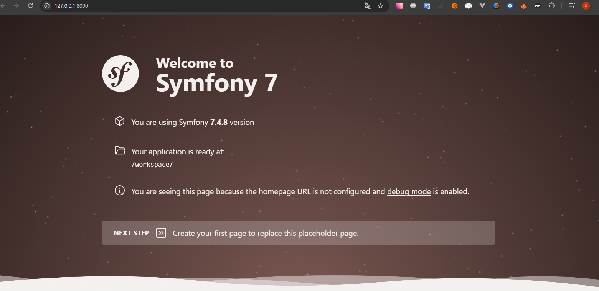

# Symfony

## English

This is my Symfony learning project.

The Symfony codebase itself lives in `symfony`.



## Overview

The project is currently focused on setting up the API foundation in Symfony.

The current implementation path is:
- launch Swagger/OpenAPI for `api/v1`
- stabilize the API entry point and documentation
- build a baseline API for working with news

## Current Status

- Docker-based local environment is configured
- Swagger UI is available for `api/v1`
- OpenAPI specification is generated automatically at runtime
- Baseline JWT authentication endpoints are prepared

## Tech Stack

- PHP `8.4+`
- Symfony Framework Bundle `8.0.8`
- Doctrine ORM `3.6.3`
- Doctrine Migrations Bundle `4.0.0`
- Doctrine Fixtures Bundle `4.3.1`
- PostgreSQL
- Symfony Serializer `8.0.8`
- Symfony Security Bundle `8.0.8`
- Symfony Validator
- Symfony Rate Limiter `8.0.8`
- LexikJWTAuthenticationBundle `3.2.0`
- GesdinetJWTRefreshTokenBundle `2.0.0`
- NelmioCorsBundle `2.6.1`
- Nelmio ApiDoc Bundle `5.9.5`
- Swagger-PHP `5.8.3`
- Pagerfanta `4.8.0`
- Gedmo Doctrine Extensions `3.22.0`
- StofDoctrineExtensionsBundle `1.15.3`
- FakerPHP Faker `1.24.1`
- Docker Compose

## Tasks

- `Task 1` - done
- Task file: [symfony/docs/task-1.md](symfony/docs/task-1.md)
- Merge Request 1: <https://github.com/ivanserg0692/symfony2026/pull/1>
- `Task 2` - in progress
- Task file: [symfony/docs/task-2.md](symfony/docs/task-2.md)

## Run With Docker Compose

Start the runner from the repository root.

```bash
cp .env.example .env
docker compose up --build -d
```

Open a shell inside the container:

```bash
docker compose exec symfony-cli bash
```

Run Symfony CLI commands directly:

```bash
docker compose run --rm symfony-cli symfony --help
docker compose run --rm symfony-cli symfony <command>
```

Run common project commands:

```bash
docker compose run --rm symfony-cli composer install
docker compose run --rm symfony-cli php bin/console about
docker compose run --rm symfony-cli php bin/console cache:clear
```

Initialize JWT keys after dependencies are installed:

```bash
docker compose -f app/docker-compose.yml exec -T symfony-cli bash bin/init-jwt
```

Sync the bootstrap admin user from environment variables:

```bash
docker compose -f app/docker-compose.yml exec -T symfony-cli php bin/console app:user:sync-admin
```

## Doctrine Database Setup

Start PostgreSQL and create the database if it does not exist yet:

```bash
docker compose -f app/docker-compose.yml up -d database
docker compose -f app/docker-compose.yml exec -T symfony-cli php bin/console doctrine:database:create --if-not-exists
docker compose -f app/docker-compose.yml exec -T symfony-cli php bin/console doctrine:migrations:status
```

Generate and apply migrations:

```bash
docker compose -f app/docker-compose.yml exec -T symfony-cli php bin/console make:migration
docker compose -f app/docker-compose.yml exec -T symfony-cli php bin/console doctrine:migrations:migrate --no-interaction
```

Quick database connection check:

```bash
docker compose -f app/docker-compose.yml exec -T symfony-cli php bin/console dbal:run-sql "SELECT 1"
```

Start the Symfony local web server:

```bash
docker compose up --build symfony-web
```

Open the app in your browser:

```text
http://localhost:8000
```

## API Documentation

API documentation for `api/v1` is generated automatically at runtime by the Symfony app.

- OpenAPI format: `3.0.0`
- Symfony bundle: `nelmio/api-doc-bundle` `v5.9.5`
- Attribute parser: `zircote/swagger-php` `5.8.3`
- UI renderer: `Swagger UI` `v7.0.0`

Available endpoints:

```text
http://localhost:8000/api/v1/doc
http://localhost:8000/api/v1/doc.json
```

The documentation includes only routes that match `^/api/v1`.

## JWT Authentication

JWT authentication is configured for the API and uses key files stored in `symfony/config/jwt`.

Login attempts are rate-limited: up to `5` failed requests per `15 minutes` for `POST /api/v1/auth/login`.

Browser clients can receive both the access JWT and the refresh token through `HttpOnly` cookies. The frontend origin for cross-origin requests is configured through `FRONTEND_ORIGIN`.

Authentication stack used in this project:
- `symfony/security-bundle` provides the firewall system, access control, user provider integration, and the custom login authenticator entry point
- `lexik/jwt-authentication-bundle` `v3.2.0` issues and validates access JWTs, reads them from the `Authorization` header or `AUTH_TOKEN` cookie, and can automatically set the access-token cookie
- `gesdinet/jwt-refresh-token-bundle` `v2.0.0` implements the refresh-token flow, stores refresh tokens through Doctrine, rotates them, and exposes console commands for cleanup and revoke
- `symfony/rate-limiter` `v8.0.8` is used by `login_throttling` to limit failed login attempts
- `symfony/validator` validates the login DTO fields such as `email`, `password`, and `turnstileToken`
- `pixelopen/cloudflare-turnstile-bundle` validates the Cloudflare Turnstile token before password authentication continues
- `nelmio/cors-bundle` `v2.6.1` adds CORS headers for cross-origin frontend requests with `credentials: include`
- `doctrine/orm` persists refresh tokens in the database and lets them be managed through migrations and cleanup commands
- `nelmio/api-doc-bundle` and `zircote/swagger-php` document the authentication endpoints in Swagger/OpenAPI

Before generating the keypair, set `JWT_PASSPHRASE` in `app/.env.local`:

```env
JWT_PASSPHRASE=!ChangeMe!
```

For cross-origin frontend requests, also set:

```env
FRONTEND_ORIGIN=http://localhost:3000
```

For the first admin bootstrap, set:

```env
APP_ADMIN_LOGIN=admin@example.com
APP_ADMIN_PASSWORD=!ChangeMeAdmin!
```

Then synchronize the admin user:

```bash
docker compose -f app/docker-compose.yml exec -T symfony-cli php bin/console app:user:sync-admin
```

How it works:
- if the user with `APP_ADMIN_LOGIN` does not exist, the command creates it with `ROLE_ADMIN`
- if the user already exists, the command keeps the account and resets the password from `APP_ADMIN_PASSWORD`
- the login value is stored in the `email` field because the current security flow authenticates by email and password

Then initialize the JWT keypair:

```bash
docker compose -f app/docker-compose.yml exec -T symfony-cli bash bin/init-jwt
```

Available authentication endpoints:

```text
POST http://localhost:8000/api/v1/auth/login
POST http://localhost:8000/api/v1/auth/refresh
GET  http://localhost:8000/api/v1/auth/me
```

Login request example:

```bash
curl -X POST http://localhost:8000/api/v1/auth/login \
  -H 'Content-Type: application/json' \
  -d '{"email":"user@example.com","password":"password123","turnstileToken":"<turnstile_token>"}'
```

Refresh request example:

```bash
curl -i -X POST http://localhost:8000/api/v1/auth/refresh \
  -H 'Cookie: refresh_token=<refresh_token>'
```

Cleanup invalid refresh tokens:

```bash
docker compose -f app/docker-compose.yml exec -T symfony-cli php bin/console gesdinet:jwt:clear
```

Example cron entry for periodic cleanup:

```cron
0 * * * * cd /home/ivan/symfony2026 && docker compose -f app/docker-compose.yml exec -T symfony-cli php bin/console gesdinet:jwt:clear
```

Cross-origin CORS preflight example:

```bash
curl -i -X OPTIONS http://localhost:8000/api/v1/auth/login \
  -H 'Origin: http://localhost:3000' \
  -H 'Access-Control-Request-Method: POST' \
  -H 'Access-Control-Request-Headers: content-type'
```

What to verify:
- the login request includes a valid `turnstileToken` obtained from Cloudflare Turnstile on the frontend
- the login response includes `Set-Cookie` for both `AUTH_TOKEN` and the refresh token cookie
- the refresh response issues a new access token and rotates the refresh token
- expired and invalid refresh tokens can be removed with `gesdinet:jwt:clear`
- cross-origin responses include `Access-Control-Allow-Origin` with the exact frontend origin
- cross-origin responses include `Access-Control-Allow-Credentials: true`
- browser requests use `credentials: 'include'`
- same-origin Swagger requests may work without any CORS headers, which is expected
- on local plain `http`, browsers may reject `SameSite=None` + `Secure` cookies

## Changelog

### 2026-04-16

- Added `GET /api/v1/news` list endpoint with pagination and sorting
- Added `ListQueryDto` for query mapping and Swagger schema description
- Added `Pagerfanta` for paginated News list responses
- Updated News query to join author data and serialize fields with `news:read` and `user:read` groups
- Expanded Swagger documentation for News list query parameters and response structure
- Added JWT authentication configuration and `/api/v1/auth/login`, `/api/v1/auth/me` endpoints
- Added `bin/init-jwt` bootstrap command for JWT key generation

### 2026-04-10

- Added Swagger/OpenAPI support for `api/v1`
- Fixed the current API documentation stack in this README
- Added task description for Swagger launch and baseline News API preparation

## Source Directory

Project files are mounted from `symfony` into `/workspace` inside the container.

## Project Structure

- `symfony` contains the Symfony application codebase
- `docker` stores Docker-related files
- `docker-compose.yml` defines the local development container setup

## Included Tools

The runner image includes `symfony`, `php`, and `composer`.

## Git Identity

Set your git identity in `.env` for git operations inside the container:

```env
GIT_AUTHOR_NAME="Your Name"
GIT_AUTHOR_EMAIL="you@example.com"
GIT_COMMITTER_NAME="Your Name"
GIT_COMMITTER_EMAIL="you@example.com"
```

## Русский

Это мой учебный проект на Symfony.

Исходный код проекта Symfony находится в каталоге `symfony`.


## Обзор

Сейчас проект сфокусирован на подготовке базового API-слоя на Symfony.

Текущий план реализации:
- запустить Swagger/OpenAPI для `api/v1`
- зафиксировать и стабилизировать точку входа в API и документацию
- реализовать базовую API для работы с новостями

## Текущий статус

- Настроено локальное окружение на Docker
- Swagger UI доступен для `api/v1`
- OpenAPI-спецификация генерируется автоматически во время запроса
- Подготовлены базовые JWT-ручки авторизации

## Технологический стек

- PHP `8.4+`
- Symfony Framework Bundle `8.0.8`
- Doctrine ORM `3.6.3`
- Doctrine Migrations Bundle `4.0.0`
- Doctrine Fixtures Bundle `4.3.1`
- PostgreSQL
- Symfony Serializer `8.0.8`
- Symfony Security Bundle `8.0.8`
- Symfony Validator
- Symfony Rate Limiter `8.0.8`
- LexikJWTAuthenticationBundle `3.2.0`
- GesdinetJWTRefreshTokenBundle `2.0.0`
- NelmioCorsBundle `2.6.1`
- Nelmio ApiDoc Bundle `5.9.5`
- Swagger-PHP `5.8.3`
- Pagerfanta `4.8.0`
- Gedmo Doctrine Extensions `3.22.0`
- StofDoctrineExtensionsBundle `1.15.3`
- FakerPHP Faker `1.24.1`
- Docker Compose

## Задачи

- `Task 1` - done
- Файл задачи: [symfony/docs/task-1.md](symfony/docs/task-1.md)
- Merge Request 1: <https://github.com/ivanserg0692/symfony2026/pull/1>
- `Task 2` - in progress
- Файл задачи: [symfony/docs/task-2.md](symfony/docs/task-2.md)

## Запуск через Docker Compose

Запускайте контейнер из корня репозитория:

```bash
cp .env.example .env
docker compose up --build -d
```

Откройте shell внутри контейнера:

```bash
docker compose exec symfony-cli bash
```

Запускайте команды Symfony CLI напрямую:

```bash
docker compose run --rm symfony-cli symfony --help
docker compose run --rm symfony-cli symfony <command>
```

Запускайте типовые команды проекта:

```bash
docker compose run --rm symfony-cli composer install
docker compose run --rm symfony-cli php bin/console about
docker compose run --rm symfony-cli php bin/console cache:clear
```

После установки зависимостей инициализируйте JWT-ключи:

```bash
docker compose -f app/docker-compose.yml exec -T symfony-cli bash bin/init-jwt
```

## Настройка Doctrine и базы данных

Поднимите PostgreSQL и создайте базу, если она еще не существует:

```bash
docker compose -f app/docker-compose.yml up -d database
docker compose -f app/docker-compose.yml exec -T symfony-cli php bin/console doctrine:database:create --if-not-exists
docker compose -f app/docker-compose.yml exec -T symfony-cli php bin/console doctrine:migrations:status
```

Сгенерируйте и примените миграции:

```bash
docker compose -f app/docker-compose.yml exec -T symfony-cli php bin/console make:migration
docker compose -f app/docker-compose.yml exec -T symfony-cli php bin/console doctrine:migrations:migrate --no-interaction
```

Быстрая проверка подключения к базе:

```bash
docker compose -f app/docker-compose.yml exec -T symfony-cli php bin/console dbal:run-sql "SELECT 1"
```

Запустите локальный Symfony web server:

```bash
docker compose up --build symfony-web
```

Откройте приложение в браузере:

```text
http://localhost:8000
```

## API Documentation

Документация API для `api/v1` генерируется автоматически во время выполнения Symfony-приложения.

- Формат OpenAPI: `3.0.0`
- Symfony bundle: `nelmio/api-doc-bundle` `v5.9.5`
- Парсер атрибутов: `zircote/swagger-php` `5.8.3`
- UI renderer: `Swagger UI` `v7.0.0`

Доступные endpoints:

```text
http://localhost:8000/api/v1/doc
http://localhost:8000/api/v1/doc.json
```

В документацию попадают только маршруты, соответствующие `^/api/v1`.

## JWT Authentication

JWT-аутентификация настроена для API и использует файлы ключей в `symfony/config/jwt`.

Для логина включено ограничение запросов: не более `5` неуспешных попыток за `15 минут` на `POST /api/v1/auth/login`.

Для браузерных клиентов access JWT и refresh token могут выдаваться через `HttpOnly` cookie. Origin фронта для cross-origin запросов задается через `FRONTEND_ORIGIN`.

Стек, который используется для аутентификации:
- `symfony/security-bundle` дает firewall-механику, `access_control`, интеграцию с user provider и точку входа для кастомного аутентификатора логина
- `lexik/jwt-authentication-bundle` `v3.2.0` отвечает за выпуск и проверку access JWT, чтение токена из `Authorization` header или `AUTH_TOKEN` cookie, а также за автоматическую установку access-cookie
- `gesdinet/jwt-refresh-token-bundle` `v2.0.0` реализует refresh-flow, хранит refresh token через Doctrine, делает ротацию токенов и дает консольные команды для очистки и revoke
- `symfony/rate-limiter` `v8.0.8` используется через `login_throttling` для ограничения неуспешных попыток логина
- `symfony/validator` валидирует DTO логина по полям `email`, `password` и `turnstileToken`
- `pixelopen/cloudflare-turnstile-bundle` проверяет Cloudflare Turnstile token до перехода к проверке пароля
- `nelmio/cors-bundle` `v2.6.1` добавляет CORS-заголовки для cross-origin фронта с `credentials: include`
- `doctrine/orm` хранит refresh token в базе и позволяет управлять ими через миграции и cleanup-команды
- `nelmio/api-doc-bundle` и `zircote/swagger-php` документируют auth-ручки в Swagger/OpenAPI

Перед генерацией ключей задайте `JWT_PASSPHRASE` в `app/.env.local`:

```env
JWT_PASSPHRASE=!ChangeMe!
```

Для фронта на другом домене также задайте:

```env
FRONTEND_ORIGIN=http://localhost:3000
```

Затем инициализируйте JWT keypair:

```bash
docker compose -f app/docker-compose.yml exec -T symfony-cli bash bin/init-jwt
```

Доступные ручки авторизации:

```text
POST http://localhost:8000/api/v1/auth/login
POST http://localhost:8000/api/v1/auth/refresh
GET  http://localhost:8000/api/v1/auth/me
```

Пример запроса на логин:

```bash
curl -X POST http://localhost:8000/api/v1/auth/login \
  -H 'Content-Type: application/json' \
  -d '{"email":"user@example.com","password":"password123","turnstileToken":"<turnstile_token>"}'
```

Пример refresh-запроса:

```bash
curl -i -X POST http://localhost:8000/api/v1/auth/refresh \
  -H 'Cookie: refresh_token=<refresh_token>'
```

Очистка невалидных refresh token:

```bash
docker compose -f app/docker-compose.yml exec -T symfony-cli php bin/console gesdinet:jwt:clear
```

Пример cron для периодической очистки:

```cron
0 * * * * cd /home/ivan/symfony2026 && docker compose -f app/docker-compose.yml exec -T symfony-cli php bin/console gesdinet:jwt:clear
```

Пример CORS preflight для cross-origin сценария:

```bash
curl -i -X OPTIONS http://localhost:8000/api/v1/auth/login \
  -H 'Origin: http://localhost:3000' \
  -H 'Access-Control-Request-Method: POST' \
  -H 'Access-Control-Request-Headers: content-type'
```

Что проверять:
- в ответе логина есть `Set-Cookie` для `AUTH_TOKEN` и refresh cookie
- refresh-ответ перевыпускает access token и ротирует refresh token
- истекшие и невалидные refresh token можно очистить командой `gesdinet:jwt:clear`
- в cross-origin ответах есть `Access-Control-Allow-Origin` с точным origin фронта
- в cross-origin ответах есть `Access-Control-Allow-Credentials: true`
- браузерные запросы идут с `credentials: 'include'`
- same-origin запросы из Swagger могут работать без CORS-заголовков, это нормально
- на локальном plain `http` браузер может отклонять cookie с `SameSite=None` и `Secure`

## История изменений

### 2026-04-16

- Добавлен endpoint `GET /api/v1/news` со списком новостей, пагинацией и сортировкой
- Добавлен `ListQueryDto` для маппинга query-параметров и описания схемы в Swagger
- Подключен `Pagerfanta` для пагинированного ответа списка News
- Обновлен запрос News: добавлен join автора и сериализация полей через группы `news:read` и `user:read`
- Расширена Swagger-документация для query-параметров и структуры ответа списка News
- Добавлен rate limit на `POST /api/v1/auth/login`

### 2026-04-10

- Добавлена поддержка Swagger/OpenAPI для `api/v1`
- Текущий стек API-документации зафиксирован в этом README
- Добавлено описание задачи по запуску Swagger и подготовке базового News API

## Каталог исходников

Файлы проекта монтируются из каталога `symfony` в `/workspace` внутри контейнера.

## Структура проекта

- `symfony` содержит кодовую базу приложения Symfony
- `docker` хранит Docker-файлы проекта
- `docker-compose.yml` описывает локальную контейнерную среду разработки

## Включенные инструменты

Образ содержит `symfony`, `php` и `composer`.

## Git-идентичность

Укажите git-идентичность в `.env`, если планируете git-операции внутри контейнера:

```env
GIT_AUTHOR_NAME="Your Name"
GIT_AUTHOR_EMAIL="you@example.com"
GIT_COMMITTER_NAME="Your Name"
GIT_COMMITTER_EMAIL="you@example.com"
```
