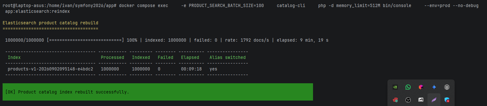

# Elasticsearch Product Catalog Reindex

<!-- START doctoc generated TOC please keep comment here to allow auto update -->
<!-- DON'T EDIT THIS SECTION, INSTEAD RE-RUN doctoc TO UPDATE -->

- [English](#english)
  - [Purpose](#purpose)
  - [Incremental indexing](#incremental-indexing)
  - [Product to CatalogElements relation](#product-to-catalogelements-relation)
  - [Configuration](#configuration)
  - [Run](#run)
  - [Verified result](#verified-result)
  - [Verify in Elasticsearch](#verify-in-elasticsearch)
  - [Failure and rollback](#failure-and-rollback)
  - [Full reindex coordination](#full-reindex-coordination)
- [Русский](#%D1%80%D1%83%D1%81%D1%81%D0%BA%D0%B8%D0%B9)
  - [Назначение](#%D0%BD%D0%B0%D0%B7%D0%BD%D0%B0%D1%87%D0%B5%D0%BD%D0%B8%D0%B5)
  - [Инкрементальная индексация](#%D0%B8%D0%BD%D0%BA%D1%80%D0%B5%D0%BC%D0%B5%D0%BD%D1%82%D0%B0%D0%BB%D1%8C%D0%BD%D0%B0%D1%8F-%D0%B8%D0%BD%D0%B4%D0%B5%D0%BA%D1%81%D0%B0%D1%86%D0%B8%D1%8F)
  - [Связь Product с CatalogElements](#%D1%81%D0%B2%D1%8F%D0%B7%D1%8C-product-%D1%81-catalogelements)
  - [Конфигурация](#%D0%BA%D0%BE%D0%BD%D1%84%D0%B8%D0%B3%D1%83%D1%80%D0%B0%D1%86%D0%B8%D1%8F)
  - [Запуск](#%D0%B7%D0%B0%D0%BF%D1%83%D1%81%D0%BA)
  - [Подтверждённый результат](#%D0%BF%D0%BE%D0%B4%D1%82%D0%B2%D0%B5%D1%80%D0%B6%D0%B4%D1%91%D0%BD%D0%BD%D1%8B%D0%B9-%D1%80%D0%B5%D0%B7%D1%83%D0%BB%D1%8C%D1%82%D0%B0%D1%82)
  - [Проверка в Elasticsearch](#%D0%BF%D1%80%D0%BE%D0%B2%D0%B5%D1%80%D0%BA%D0%B0-%D0%B2-elasticsearch)
  - [Ошибки и rollback](#%D0%BE%D1%88%D0%B8%D0%B1%D0%BA%D0%B8-%D0%B8-rollback)
  - [Координация full reindex](#%D0%BA%D0%BE%D0%BE%D1%80%D0%B4%D0%B8%D0%BD%D0%B0%D1%86%D0%B8%D1%8F-full-reindex)

<!-- END doctoc -->

## English

### Purpose

The Catalog Service rebuilds a derived product search read model from PostgreSQL. PostgreSQL remains the source of truth. Each run creates a new versioned index, bulk-indexes bounded ID-keyset batches, validates the indexed document count, and only then atomically points the `products` alias to the new index.

The old index is retained for rollback and manual cleanup. A failed or partially failed rebuild never changes the alias.

### Incremental indexing

Doctrine changes to indexed product, category, price, price-type, stock, and store data write a `CatalogElement` ID to `product_search_outbox` in the same PostgreSQL transaction. The outbox relay publishes that minimal message to the durable `catalog.search.incremental` RabbitMQ queue. The Messenger handler then reads the latest complete aggregate from PostgreSQL, reuses `ProductSearchDocumentBuilder`, and indexes the full document through the current alias. If the `CatalogElement` no longer exists, the handler deletes its document instead.

This projection is idempotent: duplicates and multiple queued changes for one product all converge on the latest PostgreSQL state. Inactive products remain indexed with `active=false`, matching full-reindex behavior.

### Product to CatalogElements relation

The `CatalogElements -> Product` association is intentionally unidirectional. Its foreign key, `catalog_elements.product_id`, exists only on the `CatalogElements` side. Adding an inverse-side `Product -> CatalogElements` one-to-one association would therefore make Doctrine query `catalog_elements` separately for every hydrated `Product`, causing N+1 queries when product collections are loaded. This is especially significant for `ProductSnapshot` queries: a product used as snapshot data may have no corresponding `CatalogElements`, but Doctrine would still have to query for that association.

Avoiding the N+1 would require every query that loads products, including the different `ProductSnapshot` loading paths, to add an explicit fetch join. The inverse association and its compensating joins were removed in commit `da820fe` while optimizing the SQL query count and must not be restored for incremental indexing.

When a `Product` change must be mapped to an affected search document, incremental indexing uses a narrow ORM repository query that accepts the `Product` object and resolves its `CatalogElements`. Other relational impacts are resolved through the ORM associations already present on their entities.

### Configuration

Keep real credentials in the repository-root `.env.local`:

```dotenv
ELASTICSEARCH_USERNAME=elastic
ELASTIC_PASSWORD=replace-with-local-password
KIBANA_PASSWORD=replace-with-local-password
```

The following non-secret settings are configurable through the environment and have project defaults:

```dotenv
ELASTICSEARCH_URL=http://elasticsearch:9200
PRODUCT_SEARCH_INDEX_PREFIX=products
PRODUCT_SEARCH_INDEX_ALIAS=products
PRODUCT_SEARCH_BATCH_SIZE=500
PRODUCT_SEARCH_REINDEX_LOCK_ID=1633906547
RABBITMQ_DEFAULT_USER=app
RABBITMQ_DEFAULT_PASS=replace-with-local-password
```

Keep RabbitMQ credentials in the repository-root `.env.local`. Docker Compose builds the internal Messenger DSN from them without copying the password to a tracked service file. The values above are placeholders.

After applying the Catalog database migration, start the two workers in the active Compose context:

```bash
npm run db:migrate
docker compose up -d catalog-search-outbox-worker catalog-search-index-worker
```

### Run

Run the rebuild from the repository root in the currently active Docker Compose context:

```bash
npm run catalog:elasticsearch:reindex
```

The operational script uses a batch size of `100`, a PHP memory limit of `512M`, and Symfony's production environment without debug mode. Override these values when needed:

```bash
PRODUCT_SEARCH_BATCH_SIZE=50 \
PRODUCT_SEARCH_REINDEX_MEMORY_LIMIT=1G \
npm run catalog:elasticsearch:reindex
```

The command exits successfully only when every bulk item succeeded, the target count equals the successful indexing count, and the alias switch completed.

The incremental pipeline runs in two services:

- `catalog-search-outbox-worker` keeps publishing committed outbox rows to RabbitMQ, including during a full rebuild;
- `catalog-search-index-worker` consumes RabbitMQ messages and updates Elasticsearch.

Inspect queue statistics and failed messages with:

```bash
docker compose exec catalog-cli php bin/console messenger:stats
docker compose exec catalog-cli php bin/console messenger:failed:show --transport=catalog_search_failed
```

### Verified result

The full rebuild was verified on a catalog containing one million products:

- processed: `1,000,000`;
- indexed: `1,000,000`;
- failed: `0`;
- average rate: approximately `1,792 docs/s`;
- elapsed time: `00:09:18`;
- alias switched: `yes`.



### Verify in Elasticsearch

```bash
docker compose exec -T elasticsearch sh -lc \
  'curl --fail --silent --show-error --user "elastic:${ELASTIC_PASSWORD}" "http://localhost:9200/_cat/aliases/products?v"'

docker compose exec -T elasticsearch sh -lc \
  'curl --fail --silent --show-error --user "elastic:${ELASTIC_PASSWORD}" "http://localhost:9200/products/_count?pretty"'

docker compose exec -T elasticsearch sh -lc \
  'curl --fail --silent --show-error --user "elastic:${ELASTIC_PASSWORD}" "http://localhost:9200/products/_search?size=1&pretty"'
```

In Kibana Dev Tools at `http://127.0.0.1:5601`, run:

```http
GET /_cat/aliases/products?v
GET /products/_count
GET /products/_search
{
  "size": 1,
  "query": { "match_all": {} }
}
```

### Failure and rollback

Bulk item failures are logged with the catalog element ID and Elasticsearch error. The summary reports processed, indexed, and failed counts. On any failure the old alias remains active and the incomplete versioned index is retained for diagnosis.

To roll back after a successful switch, atomically remove the alias from the current index and add it to the retained previous index using Elasticsearch `_aliases`. Delete old versioned indices only after confirming that rollback is no longer required.

Incremental Elasticsearch failures are retried with exponential backoff. After retries are exhausted, the message remains in the durable `catalog.search.failed` RabbitMQ queue. Once Elasticsearch or the data problem is fixed, replay retained messages with:

```bash
docker compose exec catalog-cli php bin/console messenger:failed:retry --transport=catalog_search_failed
```

If RabbitMQ is unavailable, unpublished rows remain in `product_search_outbox`; the relay retries without losing the PostgreSQL change. A relay crash after RabbitMQ accepted a message but before `published_at` was stored can produce a duplicate, which is safe because the handler rebuilds the full current document.

### Full reindex coordination

Always start full reindex through `npm run catalog:elasticsearch:reindex`. The orchestration script takes a host lock, stops only `catalog-search-index-worker`, and then starts the Symfony rebuild command, which also holds a PostgreSQL advisory lock until completion. Business writes remain available, transactional outbox rows continue to be committed, and `catalog-search-outbox-worker` continues filling the durable RabbitMQ queue.

After the new physical index is validated, Elasticsearch switches the alias atomically. The advisory lock is released and the shell `trap` restarts the incremental worker. Accumulated messages then read the latest PostgreSQL state and converge the new index to the source of truth.

If rebuilding fails, the alias remains on the old index. The application releases its advisory lock in `finally`, and the orchestration `trap` restarts the incremental worker so queued changes are applied to the still-active index. A direct `app:elasticsearch:reindex` invocation is rejected unless the orchestration explicitly marks the incremental worker as paused.

## Русский

### Назначение

Catalog Service восстанавливает производную поисковую read-model товаров из PostgreSQL. PostgreSQL остаётся источником истины. Каждый запуск создаёт новый versioned index, загружает ограниченные batch по keyset `id`, проверяет число документов и только после этого атомарно переключает alias `products`.

Старый индекс сохраняется для rollback и ручной очистки. Неуспешный или частично успешный rebuild никогда не меняет alias.

### Инкрементальная индексация

Изменения индексируемых данных товара, категории, цены, типа цены, остатка и склада записывают ID `CatalogElement` в таблицу `product_search_outbox` в той же PostgreSQL-транзакции. Outbox relay публикует минимальное сообщение в durable-очередь RabbitMQ `catalog.search.incremental`. Messenger handler заново читает полный актуальный агрегат из PostgreSQL, использует общий `ProductSearchDocumentBuilder` и индексирует весь документ через текущий alias. Если `CatalogElement` больше не существует, handler удаляет документ.

Проекция идемпотентна: дубликаты и несколько накопленных изменений одного товара приводят индекс к последнему состоянию PostgreSQL. Неактивные товары остаются в индексе с `active=false`, как и при full reindex.

### Связь Product с CatalogElements

Связь `CatalogElements -> Product` намеренно является однонаправленной. Внешний ключ `catalog_elements.product_id` находится только на стороне `CatalogElements`. Если добавить обратную inverse-side `OneToOne` связь `Product -> CatalogElements`, Doctrine будет отдельно запрашивать `catalog_elements` для каждого загруженного `Product`. При загрузке коллекции товаров это приводит к N+1. Особенно это затрагивает запросы `ProductSnapshot`: продукт, используемый как snapshot-данные, может не иметь соответствующего `CatalogElements`, но Doctrine всё равно должен выполнить запрос для определения этой связи.

Чтобы избежать N+1, пришлось бы добавлять явный fetch join во все запросы, загружающие товары, включая разные пути загрузки `ProductSnapshot`. Обратная связь и компенсирующие её join были удалены в коммите `da820fe` при оптимизации количества SQL-запросов и не должны возвращаться ради incremental indexing.

Когда изменение `Product` необходимо сопоставить с затронутым поисковым документом, incremental indexing использует узкий ORM-запрос репозитория: принимает объект `Product` и находит его `CatalogElements`. Влияние остальных связанных сущностей определяется через уже существующие у них ORM relations.

### Конфигурация

Реальные credentials должны находиться в `.env.local` в корне репозитория:

```dotenv
ELASTICSEARCH_USERNAME=elastic
ELASTIC_PASSWORD=replace-with-local-password
KIBANA_PASSWORD=replace-with-local-password
```

Остальные настройки не являются секретами, передаются через environment и имеют проектные значения по умолчанию:

```dotenv
ELASTICSEARCH_URL=http://elasticsearch:9200
PRODUCT_SEARCH_INDEX_PREFIX=products
PRODUCT_SEARCH_INDEX_ALIAS=products
PRODUCT_SEARCH_BATCH_SIZE=500
PRODUCT_SEARCH_REINDEX_LOCK_ID=1633906547
RABBITMQ_DEFAULT_USER=app
RABBITMQ_DEFAULT_PASS=replace-with-local-password
```

Реальные RabbitMQ credentials должны находиться в `.env.local` в корне репозитория. Docker Compose формирует внутренний Messenger DSN из них, не копируя пароль в tracked service-файл. Здесь указаны только placeholder-значения.

После применения миграции Catalog database запустите два worker в активном Compose context:

```bash
npm run db:migrate
docker compose up -d catalog-search-outbox-worker catalog-search-index-worker
```

### Запуск

Запустите rebuild из корня репозитория в текущем активном Docker Compose context:

```bash
npm run catalog:elasticsearch:reindex
```

Эксплуатационный скрипт использует batch size `100`, PHP memory limit `512M` и production-окружение Symfony без debug mode. При необходимости значения можно переопределить:

```bash
PRODUCT_SEARCH_BATCH_SIZE=50 \
PRODUCT_SEARCH_REINDEX_MEMORY_LIMIT=1G \
npm run catalog:elasticsearch:reindex
```

Команда завершится успешно только если все элементы bulk-запросов проиндексированы, count целевого индекса совпал с числом успешных операций и alias был переключён.

Incremental pipeline работает в двух сервисах:

- `catalog-search-outbox-worker` публикует committed outbox rows в RabbitMQ, в том числе во время full reindex;
- `catalog-search-index-worker` получает сообщения RabbitMQ и обновляет Elasticsearch.

Статистика очередей и failed messages:

```bash
docker compose exec catalog-cli php bin/console messenger:stats
docker compose exec catalog-cli php bin/console messenger:failed:show --transport=catalog_search_failed
```

### Подтверждённый результат

Полный rebuild проверен на каталоге из одного миллиона товаров:

- обработано: `1 000 000`;
- проиндексировано: `1 000 000`;
- ошибок: `0`;
- средняя скорость: около `1 792 docs/s`;
- время выполнения: `00:09:18`;
- alias переключён: `yes`.


### Проверка в Elasticsearch

```bash
docker compose exec -T elasticsearch sh -lc \
  'curl --fail --silent --show-error --user "elastic:${ELASTIC_PASSWORD}" "http://localhost:9200/_cat/aliases/products?v"'

docker compose exec -T elasticsearch sh -lc \
  'curl --fail --silent --show-error --user "elastic:${ELASTIC_PASSWORD}" "http://localhost:9200/products/_count?pretty"'

docker compose exec -T elasticsearch sh -lc \
  'curl --fail --silent --show-error --user "elastic:${ELASTIC_PASSWORD}" "http://localhost:9200/products/_search?size=1&pretty"'
```

В Kibana Dev Tools по адресу `http://127.0.0.1:5601`:

```http
GET /_cat/aliases/products?v
GET /products/_count
GET /products/_search
{
  "size": 1,
  "query": { "match_all": {} }
}
```

### Ошибки и rollback

Для каждой ошибки bulk-индексации логируются ID элемента каталога и ответ Elasticsearch. Итоговая таблица показывает processed, indexed и failed. При любой ошибке старый alias остаётся активным, а незавершённый versioned index сохраняется для диагностики.

Для rollback после успешного переключения нужно одним запросом `_aliases` снять alias с текущего индекса и назначить сохранённому предыдущему индексу. Старые индексы следует удалять только после окончания периода rollback.

Ошибки incremental indexing повторяются с exponential backoff. После исчерпания retry сообщение остаётся в durable RabbitMQ-очереди `catalog.search.failed`. После восстановления Elasticsearch или исправления данных сообщения повторно запускаются командой:

```bash
docker compose exec catalog-cli php bin/console messenger:failed:retry --transport=catalog_search_failed
```

Если RabbitMQ недоступен, неопубликованные строки остаются в `product_search_outbox`, а relay продолжает попытки без потери PostgreSQL-изменения. Сбой relay после принятия сообщения RabbitMQ, но до записи `published_at`, может создать дубликат; это безопасно, потому что handler каждый раз строит полный актуальный документ.

### Координация full reindex

Full reindex всегда запускается через `npm run catalog:elasticsearch:reindex`. Orchestration-скрипт устанавливает host lock, останавливает только `catalog-search-index-worker`, затем запускает Symfony rebuild, который дополнительно удерживает PostgreSQL advisory lock до завершения. Бизнес-записи продолжаются, transactional outbox принимает события, а `catalog-search-outbox-worker` продолжает наполнять durable RabbitMQ-очередь.

После проверки нового физического индекса Elasticsearch атомарно переключает alias. Advisory lock снимается, shell `trap` снова запускает incremental worker. Накопленные сообщения читают последнее состояние PostgreSQL и приводят новый индекс к состоянию source of truth.

При ошибке rebuild alias остаётся на старом индексе. Advisory lock освобождается в `finally`, а orchestration `trap` возобновляет incremental worker, поэтому накопленные события применяются к прежнему рабочему индексу. Прямой запуск `app:elasticsearch:reindex` отклоняется, если orchestration явно не отметила incremental worker как остановленный.
