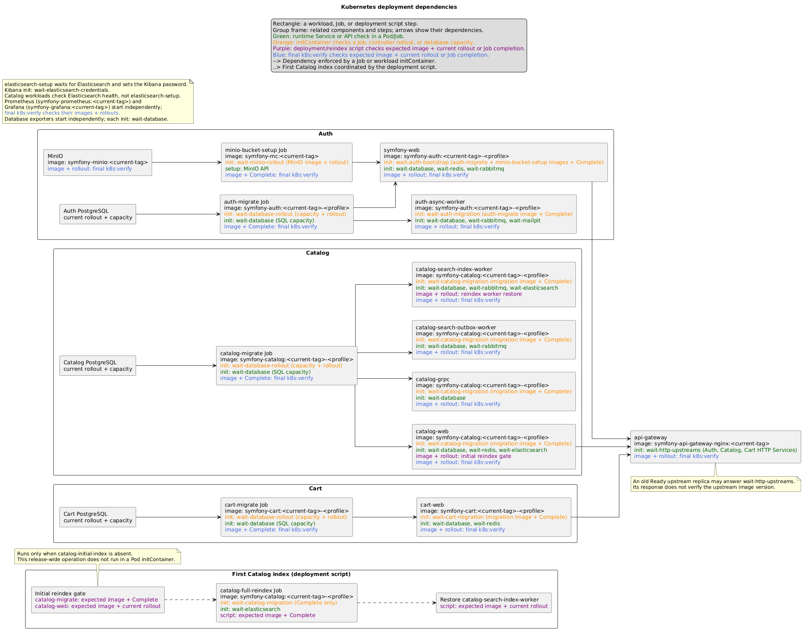
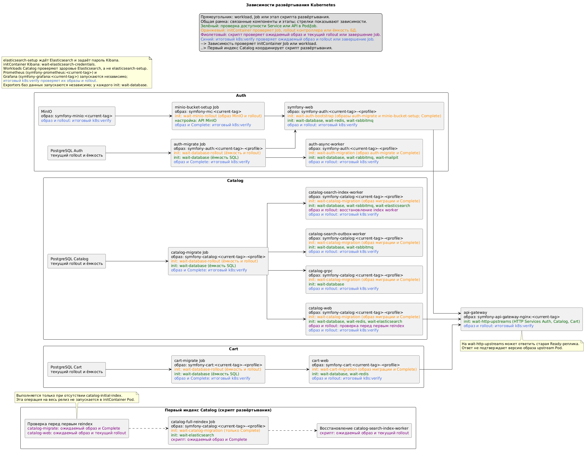

# Kubernetes deployment

<!-- START doctoc generated TOC please keep comment here to allow auto update -->
<!-- DON'T EDIT THIS SECTION, INSTEAD RE-RUN doctoc TO UPDATE -->

- [English](#english)
  - [Runtime and images](#runtime-and-images)
  - [First deployment and subsequent deployments](#first-deployment-and-subsequent-deployments)
  - [Helm chart and release operations](#helm-chart-and-release-operations)
  - [Access, maintenance, and scaling](#access-maintenance-and-scaling)
  - [Monitoring](#monitoring)
    - [Resource diagnosis and load testing](#resource-diagnosis-and-load-testing)
- [Русский](#%D1%80%D1%83%D1%81%D1%81%D0%BA%D0%B8%D0%B9)
  - [Runtime и образы](#runtime-%D0%B8-%D0%BE%D0%B1%D1%80%D0%B0%D0%B7%D1%8B)
  - [Первое и последующие развёртывания](#%D0%BF%D0%B5%D1%80%D0%B2%D0%BE%D0%B5-%D0%B8-%D0%BF%D0%BE%D1%81%D0%BB%D0%B5%D0%B4%D1%83%D1%8E%D1%89%D0%B8%D0%B5-%D1%80%D0%B0%D0%B7%D0%B2%D1%91%D1%80%D1%82%D1%8B%D0%B2%D0%B0%D0%BD%D0%B8%D1%8F)
  - [Helm chart и операции с release](#helm-chart-%D0%B8-%D0%BE%D0%BF%D0%B5%D1%80%D0%B0%D1%86%D0%B8%D0%B8-%D1%81-release)
  - [Доступ, обслуживание и масштабирование](#%D0%B4%D0%BE%D1%81%D1%82%D1%83%D0%BF-%D0%BE%D0%B1%D1%81%D0%BB%D1%83%D0%B6%D0%B8%D0%B2%D0%B0%D0%BD%D0%B8%D0%B5-%D0%B8-%D0%BC%D0%B0%D1%81%D1%88%D1%82%D0%B0%D0%B1%D0%B8%D1%80%D0%BE%D0%B2%D0%B0%D0%BD%D0%B8%D0%B5)
  - [Мониторинг](#%D0%BC%D0%BE%D0%BD%D0%B8%D1%82%D0%BE%D1%80%D0%B8%D0%BD%D0%B3)
    - [Диагностика ресурсов и нагрузочное тестирование](#%D0%B4%D0%B8%D0%B0%D0%B3%D0%BD%D0%BE%D1%81%D1%82%D0%B8%D0%BA%D0%B0-%D1%80%D0%B5%D1%81%D1%83%D1%80%D1%81%D0%BE%D0%B2-%D0%B8-%D0%BD%D0%B0%D0%B3%D1%80%D1%83%D0%B7%D0%BE%D1%87%D0%BD%D0%BE%D0%B5-%D1%82%D0%B5%D1%81%D1%82%D0%B8%D1%80%D0%BE%D0%B2%D0%B0%D0%BD%D0%B8%D0%B5)

<!-- END doctoc -->

## English

### Runtime and images

The chart under `kubernetes/helm/symfony2026` renders the existing Kubernetes resources. It contains no kind node names, kind networking, or host source mounts. The application namespace comes from the Helm release namespace (`K8S_NAMESPACE` in the deployment script); `monitoring` is a separate namespace. A default StorageClass is required for the stateful services. Docker Compose remains an independent workflow with its existing bind mounts.

- Local development (`npm run set:dev`): Docker, Docker Compose, kubectl, Helm, OpenSSL, and kind. `npm run prerequisites:check` checks them. `npm run docker:k8s:build` builds the PHP base, three image profiles for each of Auth, Catalog, and Cart, plus gateway, Prometheus, Grafana, MinIO, and mc. `npm run k8s:cluster:init` creates/selects the kind cluster before Secret synchronization; `npm run k8s:deploy` also selects it, loads the selected profile images, and deploys the stack.
- Existing k3s cluster (`K8S_RUNTIME=k3s` in the selected environment): Docker, Docker Compose, kubectl, Helm, OpenSSL, and k3s CLI on the deployment machine. Check with `npm run prerequisites:check`. When neither `KUBECONFIG` nor `~/.kube/config` is present, `npm run k8s:cluster:init` copies `/etc/rancher/k3s/k3s.yaml` to the current user's kubeconfig with mode `600`; this can prompt for `sudo`. An existing kubeconfig is never overwritten. For a single-node k3s cluster on the Docker host, leave `K8S_IMAGE_REGISTRY` and `K8S_IMAGE_TAG` unset: `npm run k8s:deploy` imports the selected local images into k3s containerd and may prompt for `sudo`.
- Other Kubernetes cluster (default `prod` configuration): Docker, Docker Compose, kubectl, Helm, and OpenSSL. Check with `npm run prerequisites:check`.

The root `.env` selects `K8S_RUNTIME=kubernetes`, `K8S_NAMESPACE=symfony2026`, and `K8S_IMAGE_PROFILE=prod` by default. `set:dev` selects the local runtime and dev namespace/profile; `set:load-test` selects k3s and its own load-test namespace/profile. Change `K8S_RUNTIME` in the selected environment file when targeting a different runtime. Local k3s imports are suitable only when every scheduled workload runs on the same node; import the images on every schedulable node or use a registry for a multi-node cluster. For registry-backed k3s or another Kubernetes cluster, set `K8S_IMAGE_REGISTRY` to the repository prefix and `K8S_IMAGE_TAG` to an immutable release tag, run `npm run docker:k8s:build`, then manually tag and push the selected Auth, Catalog, and Cart images as `<release-tag>-<K8S_IMAGE_PROFILE>` and the gateway, Prometheus, Grafana, MinIO, and mc images as `<release-tag>`. Run `npm run k8s:cluster:init` before synchronizing Secrets. This checks the existing kubectl context; it does not create a remote cluster. Deploy with `npm run k8s:deploy`. `AUTH_JWT_BOOTSTRAP_IMAGE` is set to the selected local or registry Auth image. A configured registry must be reachable by both the deployment machine's Docker daemon (for JWT bootstrap) and cluster nodes. Registry credentials, when needed, are provided through normal Docker login and Kubernetes imagePullSecrets for the target cluster. The MinIO and mc source release tags are pinned in `docker/minio/Dockerfile`; both Compose and Kubernetes use these project-built images.

For local kind and single-node k3s imports, the successful build writes the exact per-image numbered tags to the ignored `kubernetes/generated/image-refs.tsv`. Deploy reads that file and checks that each selected image still exists locally; it does not choose the highest tag currently present in Docker. An unchanged image keeps its existing numbered tag. Registry deployments continue to use the explicitly configured immutable release tag. Workload rollout checks wait for the current Pod template and all desired replicas, so an older Ready Pod cannot satisfy deployment validation.

### First deployment and subsequent deployments

For the first local deployment, activate `npm run set:dev`, then run these commands from the repository root in order:

```bash
# Build the PHP base, all three application profiles, and the shared images.
npm run docker:k8s:build

# Generate reviewable Helm values from the current project configuration.
npm run k8s:config:sync

# Verify that the generated Helm values matches its sources.
npm run k8s:config:sync -- --check

# Create/select the local kind cluster before sending Secrets to its API server.
npm run k8s:cluster:init

# Send secret values directly to Kubernetes Secrets without writing secret YAML.
npm run k8s:secrets:sync

# Deploy the generated configuration, infrastructure, applications, and monitoring.
npm run k8s:deploy
```

After building the images, run `npm run k8s:config:sync` and review `kubernetes/generated/<K8S_NAMESPACE>/generated-values.yaml` in Git diff. The command resolves Compose environment plus each Symfony service's `.env` hierarchy, writes only non-secret Helm values, and never contacts Kubernetes. `npm run k8s:config:sync -- --check` fails if the generated file is stale. Run `npm run k8s:cluster:init` before `npm run k8s:secrets:sync`; Secret synchronization requires a reachable Kubernetes API server. The cluster command only prepares access to the cluster, while Secret synchronization creates the application and monitoring namespaces when needed and sends secret values directly to Kubernetes Secrets without writing secret YAML. All Kubernetes commands use `K8S_RUNTIME` and `K8S_NAMESPACE` from the same selected environment. Resynchronize Helm values when their sources change; synchronize Secrets for each new cluster and when secret sources change.

`k8s:deploy` passes the previously generated values to Helm with `-f`, requires the application, infrastructure and Grafana Secrets to exist, and prepares the `auth-jwt` Secret. It runs `helm upgrade --install` for infrastructure, applications, gateway, exporters, and monitoring. The five bootstrap Jobs are Helm post-install/post-upgrade/post-rollback hooks; Helm deletes each previous completed Job before recreating it and waits for hook completion. Each migration Job waits for its PostgreSQL Service; each application Pod waits for its own migration Job and runtime Services. Auth HTTP also waits for the MinIO bucket setup Job. The Jobs perform one-time work, while Pod initContainers only check completion and availability. Existing readiness probes control traffic. Helm recreates completed bootstrap Jobs for each release, and the script performs the first Catalog full reindex once after the Catalog workers are running. A changed PostgreSQL capacity ConfigMap name is referenced by the StatefulSet template, so Helm rolls out PostgreSQL before migrations. The script does not regenerate Helm values or synchronize application Secrets. The JWT bootstrap reuses a complete local PEM pair or calls the existing `bin/init-jwt` if both files are absent; a half pair is an error. An existing Kubernetes `auth-jwt` Secret is reused. Auth Pods only mount that Secret. All Auth replicas use one APP_SECRET and one Redis session store.

The diagram shows Job and workload dependencies as solid arrows and the first Catalog reindex coordination in the deployment script as dotted arrows. Arrows point from a prerequisite to the stage that follows it; each workload box lists its runtime Service checks. Gateway waits for HTTP Service availability; that check alone does not prove the upstream Pod runs the requested image.

<!-- plantuml src="../symfony/docs/plantuml/kubernetes/deployment-dependencies.puml" alt="Kubernetes deployment dependencies" out="../symfony/docs/images/plantuml/kubernetes/deployment-dependencies.png" -->

<!-- /plantuml -->

The same deploy command can run again. Completed setup/migration hooks are recreated and Doctrine migrations are idempotent. PersistentVolumeClaims and JWT keys are not deleted. Explicit secret synchronization preserves a generated Auth APP_SECRET and Grafana credentials from their Kubernetes Secrets. If the cluster already contains application data, plan a separate backup/restore before pointing this deployment at it; Compose volumes are not migrated automatically. Keep the Kubernetes Secrets and PVCs backed up.

Synchronization reads the root `.env` and `.env.local` through Compose and the service-local `.env`, `.env.local`, `.env.<APP_ENV>`, and `.env.<APP_ENV>.local` through Symfony Dotenv inside the selected profile images. Compose process values take precedence. `K8S_IMAGE_PROFILE` selects the Kubernetes PHP images: `dev` sets `APP_ENV=dev`, `APP_DEBUG=1`, and enables Turnstile; `prod` sets `APP_ENV=prod`, `APP_DEBUG=0`, and enables Turnstile; `load-test` uses prod Symfony settings with Turnstile disabled. The Kubernetes dev image keeps the PHP-FPM/Nginx server and includes Composer dev dependencies; the Compose dev server and bind mounts remain unchanged. The commands do not modify source env files. Real credentials remain in the root `.env.local` and Kubernetes Secrets. Update `K8S_PUBLIC_BASE_URL` when the gateway is published under a nonlocal URL. The default `http://localhost:8001` URL is for local testing with the optional Gateway forward. After changing ConfigMaps or Secrets, restart affected Deployments; existing Pods do not automatically reload environment variables or subPath mounted files.

### Helm chart and release operations

`kubernetes/helm/symfony2026` contains `Chart.yaml`, `values.yaml`, and templates for the former infrastructure, bootstrap, application, exporter, gateway, and monitoring manifests. Image references and replica counts are chart values. `npm run k8s:config:sync` computes non-secret configuration data and PostgreSQL capacity in `generated-values.yaml`; Helm templates create all seven ConfigMaps and derive capacity ConfigMap names from the calculated values. Cluster-only Secret synchronization remains unchanged. No HPA resource exists in the current deployment.

For an offline structural check of the chart (the example image references in `values.yaml` are not release images):

```bash
helm lint kubernetes/helm/symfony2026 --namespace "$K8S_NAMESPACE" -f "kubernetes/generated/$K8S_NAMESPACE/generated-values.yaml"
helm template symfony2026 kubernetes/helm/symfony2026 --namespace "$K8S_NAMESPACE" -f "kubernetes/generated/$K8S_NAMESPACE/generated-values.yaml"
```

For a real release, use `npm run k8s:deploy`: it resolves the selected image references, loads local images when needed, checks Secrets, then runs `helm upgrade --install symfony2026 ... --take-ownership`. The same chart also supports direct `helm install`, `helm upgrade`, and `helm upgrade --install` when you pass the same generated values file with `-f` and image values used in `scripts/k8s-deploy.sh`. Use `--namespace "$K8S_NAMESPACE" --take-ownership` to adopt an existing kubectl deployment and the monitoring namespace. Direct Helm commands require images to be available in the cluster and Secrets to have been synchronized first. For a Helm dry run, add `--dry-run=client` to an install or upgrade command; Helm may still contact the Kubernetes API to check ownership of existing resources. Do not add `--wait` or `--atomic`: application initContainers wait for post-install/upgrade Jobs, so waiting for workloads before those hooks would deadlock the release.

Inspect revisions with `helm history symfony2026 --namespace "$K8S_NAMESPACE"`; roll back with `helm rollback symfony2026 REVISION --namespace "$K8S_NAMESPACE" --timeout 15m`, then inspect `helm status symfony2026 --namespace "$K8S_NAMESPACE"` and workload rollouts. `npm run k8s:verify` compares images with the currently selected build/registry tag, so use it after rollback only when those references match the restored revision. Rollback reruns the migration/setup hooks. Helm retains only the versioned immutable PostgreSQL capacity ConfigMaps, monitoring namespace, and monitoring PVCs when resources leave the release; old capacity ConfigMaps can accumulate and may be removed manually after rollback is no longer needed; StatefulSet PVCs retain their existing Kubernetes lifecycle. Secrets and the one-time `catalog-initial-index` ConfigMap remain outside Helm. The fixed `monitoring` namespace and cluster-wide metrics RBAC names are shared resources, so deploy only one release owning them per cluster. The maintenance reindex and fixtures Jobs remain separate commands and manifests.

### Access, maintenance, and scaling

The `api-gateway` LoadBalancer Service is the normal application entry point: port `8001` routes to Nginx port `80`, then to internal ClusterIP Services. On k3s, the built-in ServiceLB publishes it without a manual NodePort. Check its address with `kubectl -n "$K8S_NAMESPACE" get service api-gateway` in the selected environment. Gateway metrics stay on the internal `api-gateway-metrics` Service.

For temporary local access, run `npm run k8s:forward` from the selected environment. It forwards Grafana (`localhost:3000`), Prometheus (`localhost:9090`), Kibana (`localhost:5601`), Mailpit (`localhost:8025`), RabbitMQ management (`localhost:15672`), and MinIO console (`localhost:9001`). Add `-- --gateway` to also forward the Gateway at `localhost:8001`; this is only for local testing and does not replace the LoadBalancer. The helper uses `K8S_NAMESPACE` for application Services and `monitoring` for monitoring Services, binds to localhost, validates all Services before starting, and stops its forwards on Ctrl+C. Internal tools remain ClusterIP.

The Catalog outbox and index consumers are independent Deployments. Full reindex is initiated with `npm run k8s:catalog:reindex`; the script takes an API-server lock, records the index worker replica count, scales only that worker to zero, waits for its Pods to stop, runs a Job using the current Catalog image, then restores the worker. The outbox relay stays active; RabbitMQ keeps incremental messages until the index worker drains them. If the operator process is killed and the lock remains, inspect the Job and use `npm run k8s:catalog:reindex -- recover` to stop the Job, restore the recorded worker count, and release the lock. Do not run the Compose reindex script against Kubernetes.

After deployment and migrations, run `npm run k8s:db:fixtures` explicitly when sample data is needed. It waits for the migration Jobs and application Deployments, loads Auth and Catalog fixtures in separate Jobs, performs the full Catalog reindex, then loads Cart fixtures. Each Job uses the PHP image currently deployed for its service. Like the Compose fixtures command, Doctrine purges existing fixture tables before loading; do not run it against data you need to keep. This command is not part of `k8s:deploy`.

For a manual scale check, run `kubectl -n symfony2026 scale deployment/symfony-web deployment/catalog-web deployment/cart-web --replicas=3`, wait for each rollout, inspect `kubectl -n symfony2026 get pods -l component=http -o wide` and `kubectl -n symfony2026 get endpointslices -l kubernetes.io/service-name=symfony-web` (repeat for Catalog and Cart). Send repeated requests through the gateway and verify that each Pod's `phpfpm_accepted_connections` series increases. Test one Auth login with requests alternating between Auth Pods to validate Redis sessions, and check JWT verification on every Pod. Restore replica counts as needed. k6/HPA checks are a later stage.

### Monitoring

The Compose Prometheus config and original Grafana dashboard are unchanged. Kubernetes has its own Prometheus config and three independent dashboards:

| Dashboard | JSON | Purpose |
|---|---|---|
| Symfony services / Kubernetes | [`grafana-dashboard.json`](../docker/grafana/k8s/grafana-dashboard.json) | Kubernetes service and Pod health, PHP-FPM, resource use, and replica counts. |
| Symfony services / Original dashboard / Kubernetes | [`grafana-original-ported-dashboard.json`](../docker/grafana/k8s/grafana-original-ported-dashboard.json) | Kubernetes port of the original Docker dashboard, preserving its application, gateway, database, and infrastructure views. |
| Symfony services / Kubernetes / Combined | [`grafana-combined-dashboard.json`](../docker/grafana/k8s/grafana-combined-dashboard.json) | Panels from the two Kubernetes dashboards in one view, with redundant panels removed. The source dashboards remain separate. |

Choose one service or **All** in the service variable. Service-specific series keep their service name; per-Pod series identify the Pod as well. The primary dashboard uses `service`; the ported and combined dashboards use `services`. PHP-FPM exporter runs beside each HTTP PHP-FPM instance and is discovered by Pod labels, so replica metrics remain distinct. Application metrics in shared Redis are scraped once through each service's ClusterIP so more replicas do not multiply central counters. PostgreSQL exporters remain separate, Nginx exporter runs beside the gateway, and node exporter is a DaemonSet. kube-state-metrics supplies Pod labels, readiness, and memory limits; cAdvisor supplies container CPU and memory usage.

#### Resource diagnosis and load testing

These are the resource views in the [combined dashboard](../docker/grafana/k8s/grafana-combined-dashboard.json); the primary dashboard contains the service/Pod CPU and absolute RAM views too, while the ported dashboard retains the all-namespace Top 15 CPU and memory-limit views. The linked JSON files contain the complete panel expressions.

| Engineering question | Actual panel and PromQL basis | How to read it |
|---|---|---|
| Which replica consumes CPU, and is one replica different? | **CPU cores by Pod**: `sum by (label_service, pod)` over `rate(container_cpu_usage_seconds_total[5m])`, joined to HTTP `kube_pod_labels` by `(namespace,pod)`. | Each `service / pod` line is actual CPU use in cores, so compare replicas before and during a k6 run. **CPU cores for service** uses `sum by (label_service)` over the same filtered HTTP Pods to show their combined use per service; selecting one Pod narrows that total too. |
| Which Pods consume most CPU anywhere in the cluster? | **Top 15 Pods by CPU (all namespaces)**: `topk(15, sum by (namespace, pod) (rate(container_cpu_usage_seconds_total{container!="",container!="POD"}[5m])))`. | Each `namespace / pod` series is in CPU cores. Stacking shows the sum of the selected Top 15 only, not total cluster CPU; membership can change with time. This panel ignores the application filters and can expose monitoring or system Pods. |
| Is a particular replica using more RAM than its peers? | **RAM bytes by Pod**: `sum by (label_service, pod)` over `container_memory_working_set_bytes`, joined to HTTP Pod labels. **RAM bytes for service** groups the same metric by `label_service`. | These are absolute working-set bytes, useful for comparing replicas or tracking total application RAM. They do not express proximity to a limit. |
| Is a workload approaching its configured memory limit? | **Memory usage / limit by service**, **by Pod (all namespaces)**, and **by service and container** use `container_memory_usage_bytes` divided by `kube_pod_container_resource_limits{resource="memory",unit="byte"}` and multiply by 100. | Service groups by `(namespace,label_service)`; Pod groups by `(namespace,pod)`; service/container groups by `(namespace,label_service,container)`. A sustained rise toward 100% deserves investigation; a ratio alone does not prove an OOM event. |

The memory numerator and denominator match on `(namespace,pod,container)` and include only containers with both a usage series and a **positive** memory limit. The service and service/container panels join `kube_pod_labels` on `(namespace,pod)`: they use `label_service` when present and copy `label_app` to `label_service` for Pods lacking it, including monitoring workloads. The service/container grouping combines replicas of the same container type within a service, while keeping `catalog / php` and `catalog / nginx`, for example, separate. Its legend also includes the namespace. The Pod-level ratio is independent of the namespace, service, and Pod selectors and is the drill-down for an outlier hidden by a service aggregate. The service and service/container ratios respect namespace and service selectors but not the Pod selector.

For a k6 run, compare gateway/application request rate and latency with **CPU cores by Pod**, **CPU cores for service**, and PHP-FPM active/idle processes and listen queue. A single hot Pod or a growing listen queue points to a different bottleneck than evenly rising CPU across replicas. Then inspect the three memory-limit views from service to container type to Pod, including monitoring/system Pods when the cluster itself is busy. Compare observed CPU cores and memory percentages against Deployment requests/limits when sizing resources; these dashboards have **no CPU usage / request or CPU usage / limit ratio panel**, so they do not themselves show CPU-boundary utilization. After configuring HPA, use **HTTP Pods: running / ready** and **Pod lifecycle** alongside the per-Pod resource lines to verify that replicas appear, become ready, share load, and disappear as expected. Validate queries against cluster labels and cAdvisor availability after deployment.

Kubernetes Prometheus and Grafana configuration files live beside their Dockerfiles under `docker/prometheus/k8s/` and `docker/grafana/k8s/` and are copied into the respective images. The Prometheus entrypoint fills in the application namespace supplied by the deployment manifest. Changes to these files require rebuilding and redeploying the monitoring images; `k8s:config:sync` only updates application and infrastructure ConfigMaps. Grafana credentials remain in `grafana-config-secret`.

## Русский

### Runtime и образы

Chart `kubernetes/helm/symfony2026` создаёт прежние Kubernetes-ресурсы и не зависит от kind, числа node и файлов исходников на host. Namespace приложения берётся из namespace Helm release (`K8S_NAMESPACE` в скрипте развёртывания); мониторинг живёт в отдельном namespace `monitoring`. Для StatefulSet нужен default StorageClass. Docker Compose остаётся отдельным способом запуска с прежними bind mounts.

- Локально (`npm run set:dev`): Docker, Docker Compose, kubectl, Helm, OpenSSL и kind. Проверка: `npm run prerequisites:check`. Команда `npm run docker:k8s:build` собирает PHP base, по три профиля образов Auth, Catalog и Cart, а также gateway, Prometheus, Grafana, MinIO и mc. `npm run k8s:cluster:init` создаёт/выбирает kind cluster до синхронизации Secret; `npm run k8s:deploy` также выбирает его, загружает образы выбранного профиля и разворачивает проект.
- В существующем k3s cluster (`K8S_RUNTIME=k3s` в выбранном окружении): те же общие CLI и k3s CLI на машине развёртывания. Проверка: `npm run prerequisites:check`. Если не заданы ни `KUBECONFIG`, ни `~/.kube/config`, команда `npm run k8s:cluster:init` копирует `/etc/rancher/k3s/k3s.yaml` в kubeconfig текущего пользователя с правами `600`; для этого может потребоваться ввод пароля `sudo`. Существующий kubeconfig не перезаписывается. Для одновузлового k3s на той же машине, где работает Docker, оставьте `K8S_IMAGE_REGISTRY` и `K8S_IMAGE_TAG` пустыми: `npm run k8s:deploy` импортирует выбранные локальные образы в containerd k3s и может запросить пароль `sudo`.
- В другом Kubernetes cluster (конфигурация `prod` по умолчанию): общие CLI без kind/k3s. Проверка: `npm run prerequisites:check`.

Корневой `.env` по умолчанию задаёт `K8S_RUNTIME=kubernetes`, `K8S_NAMESPACE=symfony2026` и `K8S_IMAGE_PROFILE=prod`. `set:dev` выбирает локальный runtime и dev namespace/profile; `set:load-test` выбирает k3s и отдельные load-test namespace/profile. Для другого целевого runtime измените `K8S_RUNTIME` в выбранном env-файле. Локальный импорт в k3s подходит только тогда, когда все workloads запускаются на том же node; для многовузлового кластера импортируйте образы на каждый schedulable node либо используйте registry. Для k3s с registry или обычного Kubernetes задайте `K8S_IMAGE_REGISTRY` (префикс репозитория) и `K8S_IMAGE_TAG` (неизменяемый release tag), запустите `npm run docker:k8s:build`, затем вручную назначьте выбранным образам Auth, Catalog и Cart тег `<release-tag>-<K8S_IMAGE_PROFILE>`, а gateway, Prometheus, Grafana, MinIO и mc — `<release-tag>`, после чего отправьте их в registry. До синхронизации Secret выполните `npm run k8s:cluster:init`. Команда проверяет текущий kubectl context, но не создаёт удалённый кластер. Для развёртывания используйте `npm run k8s:deploy`. Docker на машине запуска должен содержать выбранный локальный или registry Auth image для JWT bootstrap; при использовании registry nodes также должны иметь к нему доступ. При закрытом registry настройте Docker login и Kubernetes imagePullSecrets. Версии исходников MinIO и mc закреплены в `docker/minio/Dockerfile`; Compose и Kubernetes используют эти образы проекта.

Для локального kind и импорта в одновузловой k3s успешная сборка записывает точные нумерованные теги образов в игнорируемый Git файл `kubernetes/generated/image-refs.tsv`. Команда развёртывания читает этот файл и проверяет наличие каждого образа; она не выбирает максимальный тег из Docker. Если образ не изменился, сохраняется прежний нумерованный тег. Для registry используется явно заданный неизменяемый release tag. Проверка rollout ждёт текущий шаблон Pod и все запрошенные реплики: старый Ready Pod не считается успешным развёртыванием.

### Первое и последующие развёртывания

Для первого локального развёртывания активируйте `npm run set:dev`, затем выполните из корня репозитория по порядку:

```bash
# Собрать PHP base, три профиля приложений и общие образы.
npm run docker:k8s:build

# Создать проверяемый файл Helm values из текущей конфигурации проекта.
npm run k8s:config:sync

# Проверить, что созданный файл Helm values соответствует источникам.
npm run k8s:config:sync -- --check

# Создать/выбрать локальный kind cluster до отправки Secret в Kubernetes API.
npm run k8s:cluster:init

# Передать секретные значения напрямую в Kubernetes Secret без YAML-файла.
npm run k8s:secrets:sync

# Развернуть конфигурацию, инфраструктуру, приложения и мониторинг.
npm run k8s:deploy
```

После сборки образов запустите `npm run k8s:config:sync` и проверьте `kubernetes/generated/<K8S_NAMESPACE>/generated-values.yaml` через Git diff. Команда учитывает Compose environment и иерархию `.env` каждого Symfony-сервиса, записывает только несекретные Helm values и не обращается к Kubernetes. `npm run k8s:config:sync -- --check` сообщает об устаревшем файле. Перед `npm run k8s:secrets:sync` запустите `npm run k8s:cluster:init`: для синхронизации Secret нужен доступный Kubernetes API. Команда подготовки обеспечивает доступ к кластеру, а синхронизация Secret при необходимости создаёт namespaces приложения и мониторинга и передаёт значения напрямую в Kubernetes Secret без файла с секретами. Все Kubernetes-команды получают `K8S_RUNTIME` и `K8S_NAMESPACE` из одного выбранного окружения. Повторно синхронизируйте Helm values при изменении источников, а Secret — для каждого нового кластера и при изменении секретных значений.

`k8s:deploy` передаёт уже подготовленные Helm values через `-f`, проверяет наличие Secret приложения, инфраструктуры и Grafana и готовит `auth-jwt` Secret. Инфраструктура, приложения, gateway, exporters и мониторинг устанавливаются через `helm upgrade --install`. Пять bootstrap Jobs работают как Helm hooks после установки, обновления и отката; Helm удаляет предыдущие завершённые Jobs, создаёт новые и дожидается их завершения. Каждая migration Job ждёт свой PostgreSQL Service; Pod приложения ждёт свою migration Job и нужные runtime Services. HTTP Pod Auth также ждёт Job создания bucket в MinIO. Разовые операции выполняют Jobs, а Pod initContainers только проверяют их завершение и доступность сервисов. Существующие readiness probes управляют подачей трафика. Helm пересоздаёт завершённые bootstrap Jobs для каждого release; скрипт после запуска Catalog workers один раз выполняет первоначальный полный reindex. При изменении имени ConfigMap ёмкости Helm обновляет шаблон StatefulSet и выполняет rollout PostgreSQL до миграций. Скрипт не перегенерирует Helm values и не синхронизирует Secret приложения. JWT bootstrap использует полную существующую пару PEM; если обоих файлов нет, вызывает `bin/init-jwt`; один файл вместо пары — ошибка. Уже созданный Secret `auth-jwt` не перезаписывается. Auth Pod только монтируют этот Secret; у всех реплик общий APP_SECRET и Redis sessions.

На диаграмме сплошные стрелки показывают зависимости Jobs и workloads, а пунктирные — координацию первого Catalog reindex в скрипте развёртывания. Стрелка направлена от зависимости к следующему этапу; runtime-проверки Service перечислены внутри каждого workload. Gateway проверяет доступность HTTP Service; эта проверка сама по себе не подтверждает, что upstream Pod работает на нужном image.

<!-- plantuml src="../symfony/docs/plantuml/kubernetes-ru/deployment-dependencies.puml" alt="Зависимости развёртывания Kubernetes" out="../symfony/docs/images/plantuml/kubernetes-ru/deployment-dependencies.png" -->

<!-- /plantuml -->

Повторный deploy переиспользует JWT, PVC и Kubernetes credentials, а setup/migration Jobs создаёт заново. При явной повторной синхронизации Secret сохраняются сгенерированные APP_SECRET Auth и credentials Grafana. Doctrine migrations остаются идемпотентными. Данные из Compose volumes автоматически не переносятся: для них нужна отдельная процедура backup/restore. Secret и PVC следует резервировать.

Синхронизация читает корневые `.env` и `.env.local` через Compose и сервисные `.env`, `.env.local`, `.env.<APP_ENV>`, `.env.<APP_ENV>.local` через Symfony Dotenv внутри образов выбранного профиля. Значения process environment из Compose имеют приоритет. `K8S_IMAGE_PROFILE` выбирает Kubernetes PHP images: `dev` задаёт `APP_ENV=dev`, `APP_DEBUG=1` и включает Turnstile; `prod` задаёт `APP_ENV=prod`, `APP_DEBUG=0` и включает Turnstile; `load-test` использует prod-настройки Symfony с выключенным Turnstile. Kubernetes dev image сохраняет PHP-FPM/Nginx и содержит dev-зависимости Composer; Compose dev server и bind mounts не меняются. Исходные env-файлы не меняются. Реальные credentials остаются в корневом `.env.local` и Kubernetes Secret. Для внешнего URL gateway задайте `K8S_PUBLIC_BASE_URL`; значение по умолчанию `http://localhost:8001` подходит для локального тестирования. После обновления ConfigMap/Secret перезапускайте соответствующие Deployments: env и subPath mounts уже запущенных Pod автоматически не обновятся.

### Helm chart и операции с release

`kubernetes/helm/symfony2026` содержит `Chart.yaml`, `values.yaml` и шаблоны прежних манифестов инфраструктуры, bootstrap, приложений, exporters, gateway и мониторинга. Ссылки на images и число реплик находятся в values. `npm run k8s:config:sync` вычисляет несекретные данные и ёмкость PostgreSQL в `generated-values.yaml`; Helm создаёт все семь ConfigMap и формирует имена capacity ConfigMap из вычисленных значений. Отдельная синхронизация Secret не менялась. В текущем развёртывании нет HPA-ресурса.

Проверка структуры chart без кластера (примеры images в `values.yaml` не являются release images):

```bash
helm lint kubernetes/helm/symfony2026 --namespace "$K8S_NAMESPACE" -f "kubernetes/generated/$K8S_NAMESPACE/generated-values.yaml"
helm template symfony2026 kubernetes/helm/symfony2026 --namespace "$K8S_NAMESPACE" -f "kubernetes/generated/$K8S_NAMESPACE/generated-values.yaml"
```

Для реального release используйте `npm run k8s:deploy`: он определяет выбранные images, при необходимости загружает локальные images, проверяет Secrets и запускает `helm upgrade --install symfony2026 ... --take-ownership`. Chart поддерживает также прямые `helm install`, `helm upgrade` и `helm upgrade --install`, если передать тот же файл generated values через `-f` и значения image, что указаны в `scripts/k8s-deploy.sh`. Для принятия существующего kubectl deployment и namespace мониторинга используйте `--namespace "$K8S_NAMESPACE" --take-ownership`. Перед прямым запуском Helm образы должны быть доступны кластеру, а Secrets синхронизированы. Для Helm dry run добавьте к команде установки или обновления `--dry-run=client`; Helm может всё равно обратиться к Kubernetes API, чтобы проверить владение существующими ресурсами. Не добавляйте `--wait` или `--atomic`: initContainer приложений ждут Jobs после установки/обновления, поэтому ожидание готовности workloads до этих hooks заблокирует release.

История: `helm history symfony2026 --namespace "$K8S_NAMESPACE"`; откат: `helm rollback symfony2026 REVISION --namespace "$K8S_NAMESPACE" --timeout 15m`, затем проверьте `helm status symfony2026 --namespace "$K8S_NAMESPACE"` и rollout workloads. `npm run k8s:verify` сравнивает образы с выбранным текущим build/registry tag, поэтому после отката используйте его только когда эти ссылки совпадают с восстановленной ревизией. При откате migration/setup hooks запускаются заново. Helm сохраняет только версионированные immutable capacity ConfigMap, namespace мониторинга и его PVC после исключения ресурсов из release; старые capacity ConfigMap могут накапливаться, и их можно удалить вручную, когда откат к ним больше не нужен; PVC StatefulSet сохраняют прежний жизненный цикл Kubernetes. Secrets и однократный ConfigMap `catalog-initial-index` находятся вне Helm. Фиксированные namespace `monitoring` и имена кластерных RBAC-ресурсов общие, поэтому ими должен владеть только один release в кластере. Jobs обслуживания для reindex и fixtures остаются отдельными командами и манифестами.

### Доступ, обслуживание и масштабирование

LoadBalancer Service `api-gateway` — основная точка входа приложения: порт `8001` ведёт на Nginx `80`, затем на внутренние ClusterIP Services. В k3s встроенный ServiceLB публикует его без ручного NodePort. Адрес можно проверить командой `kubectl -n "$K8S_NAMESPACE" get service api-gateway` в выбранном окружении. Метрики Gateway остаются на внутреннем Service `api-gateway-metrics`.

Для временного локального доступа запустите `npm run k8s:forward` в выбранном окружении. Скрипт открывает Grafana (`localhost:3000`), Prometheus (`localhost:9090`), Kibana (`localhost:5601`), Mailpit (`localhost:8025`), панель RabbitMQ (`localhost:15672`) и консоль MinIO (`localhost:9001`). С `-- --gateway` он также открывает Gateway на `localhost:8001` для локального тестирования; основной путь через LoadBalancer остаётся прежним. Скрипт использует `K8S_NAMESPACE` для приложения и `monitoring` для мониторинга, проверяет Services до запуска, привязывает порты к localhost и закрывает свои процессы по Ctrl+C. Внутренние инструменты остаются ClusterIP.

Catalog outbox и index consumers — отдельные Deployments. Полный reindex запускается через `npm run k8s:catalog:reindex`: скрипт создаёт блокировку в API server, запоминает число реплик index worker, останавливает именно его, дожидается удаления Pod, выполняет Job на текущем Catalog image и возвращает worker. Outbox остаётся активным, а RabbitMQ сохраняет накопившиеся сообщения до возобновления обработки. После аварийного прерывания проверьте Job и запустите `npm run k8s:catalog:reindex -- recover`, чтобы остановить Job, восстановить число workers и снять блокировку.

После deployment и миграций при необходимости загрузите тестовые данные отдельной командой `npm run k8s:db:fixtures`. Она дожидается migration Jobs и application Deployments, последовательно загружает fixtures Auth и Catalog через отдельные Jobs, выполняет полный Catalog reindex и затем загружает fixtures Cart. Каждый Job использует PHP image своего уже развёрнутого сервиса. Как и Compose-команда, Doctrine очищает таблицы перед загрузкой; не запускайте команду для данных, которые нужно сохранить. В `k8s:deploy` загрузка fixtures не входит.

Для ручной проверки задайте три реплики через `kubectl -n symfony2026 scale deployment/symfony-web deployment/catalog-web deployment/cart-web --replicas=3`, дождитесь rollout и проверьте Pod и EndpointSlice каждого Service. Отправьте серию запросов через gateway и убедитесь, что `phpfpm_accepted_connections` растёт отдельно у каждого Pod. Проверьте Auth login/session при чередовании Pod и JWT verification на всех Pod. HPA и k6 относятся к следующему этапу.

### Мониторинг

Compose Prometheus и исходный Grafana dashboard не меняются. Kubernetes получает отдельный Prometheus config и три независимых dashboard:

| Dashboard | JSON | Назначение |
|---|---|---|
| Symfony services / Kubernetes | [`grafana-dashboard.json`](../docker/grafana/k8s/grafana-dashboard.json) | Состояние сервисов и Pod, PHP-FPM, ресурсы и число реплик. |
| Symfony services / Original dashboard / Kubernetes | [`grafana-original-ported-dashboard.json`](../docker/grafana/k8s/grafana-original-ported-dashboard.json) | Порт исходного Docker dashboard с панелями приложения, gateway, БД и инфраструктуры. |
| Symfony services / Kubernetes / Combined | [`grafana-combined-dashboard.json`](../docker/grafana/k8s/grafana-combined-dashboard.json) | Панели двух Kubernetes dashboard в одном представлении без бессмысленных дублей; исходные dashboard остаются отдельными. |

В переменной сервиса можно выбрать один сервис или **All**. Серии разных сервисов различаются именем сервиса, а серии по Pod дополнительно показывают Pod. В основном dashboard переменная называется `service`, в портированном и объединённом — `services`. PHP-FPM exporter работает рядом с каждым HTTP PHP-FPM; метрики реплик сохраняют отдельные Pod labels. Symfony metrics из общего Redis снимаются один раз через ClusterIP каждого сервиса, поэтому добавление реплик не умножает централизованные счётчики. PostgreSQL exporters остаются отдельными, Nginx exporter работает рядом с gateway, node exporter — DaemonSet. kube-state-metrics даёт Pod labels, готовность и лимиты памяти, cAdvisor — использование CPU и памяти контейнерами.

#### Диагностика ресурсов и нагрузочное тестирование

Ниже перечислены фактические панели [объединённого dashboard](../docker/grafana/k8s/grafana-combined-dashboard.json). В основном dashboard также есть CPU и абсолютная RAM по сервису и Pod, а в портированном — Top 15 CPU и панели памяти относительно лимитов для всех namespace. Полные выражения панелей находятся в связанных JSON-файлах.

| Инженерный вопрос | Панель и основа PromQL | Как интерпретировать |
|---|---|---|
| Какая реплика расходует CPU и отличается ли она от остальных? | **CPU cores by Pod**: `sum by (label_service, pod)` от `rate(container_cpu_usage_seconds_total[5m])`, соединение с метками HTTP Pod из `kube_pod_labels` по `(namespace,pod)`. | Каждая серия `service / pod` показывает фактическое потребление в ядрах CPU. Сравнивайте реплики до и во время k6-теста. **CPU cores for service** использует `sum by (label_service)` для тех же отфильтрованных HTTP Pod; выбор одного Pod сужает и эту сумму. |
| Какие Pod больше всего нагружают CPU во всём кластере? | **Top 15 Pods by CPU (all namespaces)**: `topk(15, sum by (namespace, pod) (rate(container_cpu_usage_seconds_total{container!="",container!="POD"}[5m])))`. | Серии `namespace / pod` измеряются в ядрах CPU. Верхняя граница stacked-графика — сумма выбранных Top 15, а не CPU всего кластера; состав Top 15 может меняться. Фильтры приложения не действуют, видны также monitoring и системные Pod. |
| Расходует ли одна реплика больше RAM, чем остальные? | **RAM bytes by Pod**: `sum by (label_service, pod)` от `container_memory_working_set_bytes` с метками HTTP Pod. **RAM bytes for service** группирует ту же метрику по `label_service`. | Это абсолютный working set в байтах для сравнения реплик и общего расхода сервиса; близость к лимиту он сам по себе не показывает. |
| Приближается ли контейнер или сервис к лимиту памяти? | **Memory usage / limit by service**, **by Pod (all namespaces)** и **by service and container** делят `container_memory_usage_bytes` на `kube_pod_container_resource_limits{resource="memory",unit="byte"}` и умножают на 100. | Группировка соответственно `(namespace,label_service)`, `(namespace,pod)` и `(namespace,label_service,container)`. Устойчивый рост к 100% требует проверки; один процент не доказывает OOM. |

В числитель и знаменатель отношения памяти попадают только контейнеры, для которых совпали `(namespace,pod,container)`, есть серия использования и **положительный** лимит. Панели по сервису и service/container соединяются с `kube_pod_labels` по `(namespace,pod)`: используют `label_service`, а при её отсутствии берут `label_app` как `label_service`, в том числе для workloads мониторинга. Группировка service/container объединяет реплики одного типа контейнера внутри сервиса, но оставляет отдельными, например, `catalog / php` и `catalog / nginx`; namespace тоже указан в legend. Панель по Pod не зависит от фильтров namespace, service и Pod: по ней можно найти аномальную реплику, скрытую суммой по сервису. Панели по сервису и service/container учитывают фильтры namespace и service, но не фильтр Pod.

Во время k6-теста сопоставляйте RPS и задержку gateway/приложения с **CPU cores by Pod**, **CPU cores for service**, числом активных/свободных PHP-FPM процессов и listen queue. Один перегруженный Pod или растущая очередь указывают на другую причину, чем равномерный рост CPU у всех реплик. Затем проходите по памяти от сервиса к типу контейнера и Pod; при нагрузке на кластер проверяйте также monitoring и системные Pod. Подбирая requests/limits, сравнивайте наблюдаемые ядра CPU и проценты памяти с настройками Deployment: отдельных панелей **CPU usage / request** и **CPU usage / limit** в этих dashboard сейчас **нет**, поэтому долю CPU-лимита они не показывают. После настройки HPA используйте **HTTP Pods: running / ready** и **Pod lifecycle** вместе с линиями ресурсов по Pod, чтобы проверить появление реплик, их готовность, распределение нагрузки и последующее уменьшение числа реплик. После развёртывания сверяйте запросы с labels и доступностью cAdvisor в кластере.

Kubernetes-конфигурации Prometheus и Grafana лежат рядом со своими Dockerfile в `docker/prometheus/k8s/` и `docker/grafana/k8s/` и копируются в images. Entrypoint Prometheus подставляет namespace приложения, переданный через deployment manifest. Для изменения этих файлов нужно пересобрать и повторно развернуть monitoring images; `k8s:config:sync` обновляет только ConfigMap приложения и инфраструктуры. Credentials Grafana остаются в `grafana-config-secret`.
