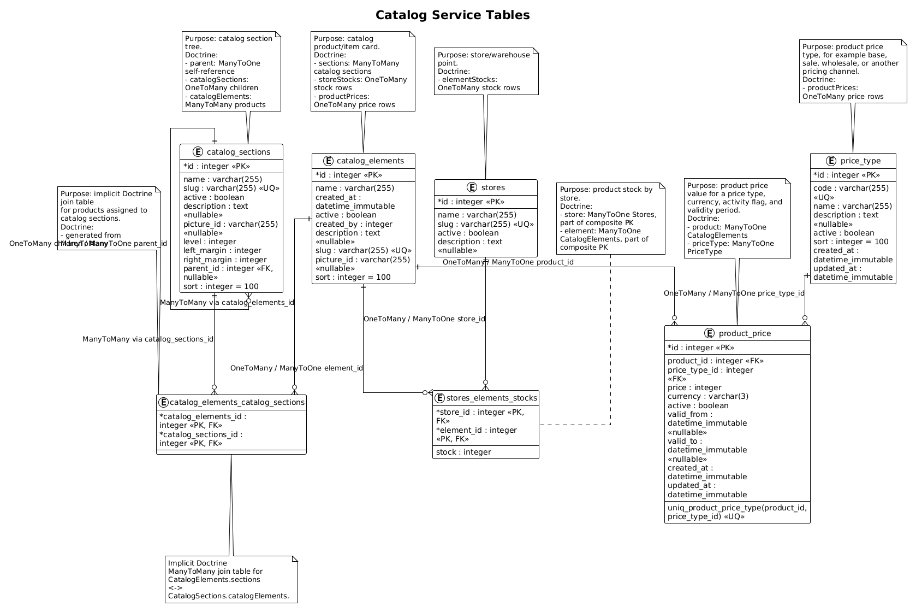

# Catalog Service Tables

<!-- START doctoc generated TOC please keep comment here to allow auto update -->
<!-- DON'T EDIT THIS SECTION, INSTEAD RE-RUN doctoc TO UPDATE -->

- [English](#english)
  - [Table ERD](#table-erd)
  - [Table Purposes](#table-purposes)

<!-- END doctoc -->

## English

### Table ERD

The diagram shows the `catalog-service` tables built from Doctrine entities and `doctrine.orm.naming_strategy.underscore`.

<!-- plantuml src="plantuml/catalog-service/tables.puml" alt="Catalog service tables" out="images/plantuml/catalog-service/tables.png" -->

<!-- /plantuml -->

### Table Purposes

| Table | Purpose | Main Doctrine relations |
| --- | --- | --- |
| `catalog_sections` | Catalog section tree. | `ManyToOne` to the parent section, `OneToMany` to child sections, `ManyToMany` with products. |
| `catalog_elements` | Product or catalog element cards. | `ManyToMany` with sections, `OneToMany` with store stocks, `OneToMany` with prices. |
| `catalog_elements_catalog_sections` | Implicit Doctrine join table for assigning products to sections. | Two `ManyToMany` sides: product and section. |
| `stores` | Stores or stock locations where inventory is tracked. | `OneToMany` with product stocks. |
| `stores_elements_stocks` | Stock of a specific product in a specific store. | Two `ManyToOne` relations: store and product; both are part of the composite primary key. |
| `price_type` | Product price types: base, promotional, wholesale, or another price channel. | `OneToMany` with product prices. |
| `product_price` | Product price for a specific price type, currency, and validity period. | `ManyToOne` to product and `ManyToOne` to price type. |
