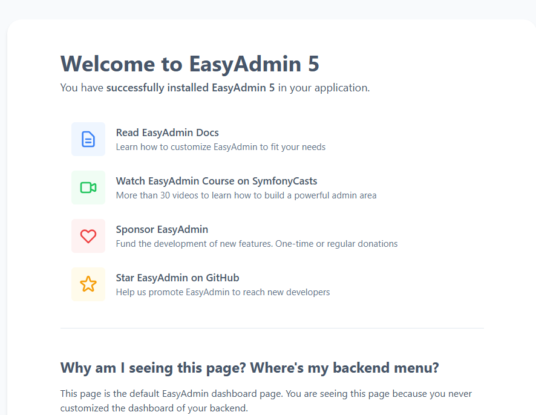
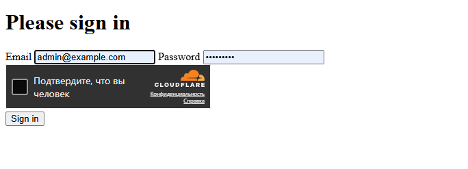
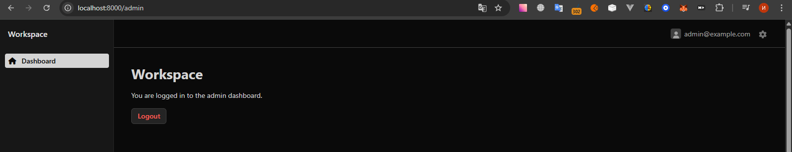
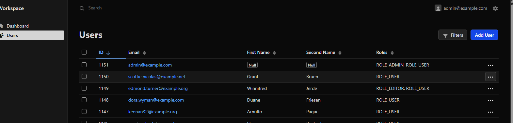
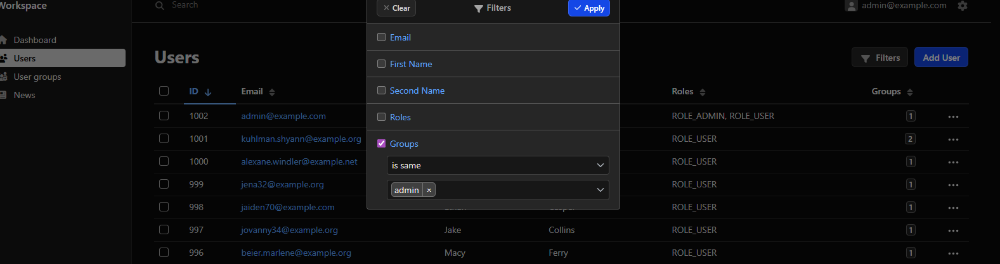
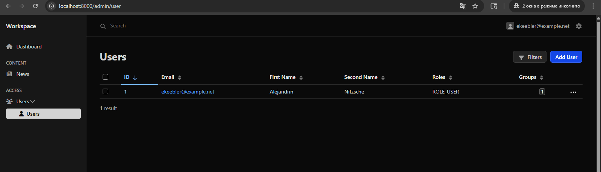
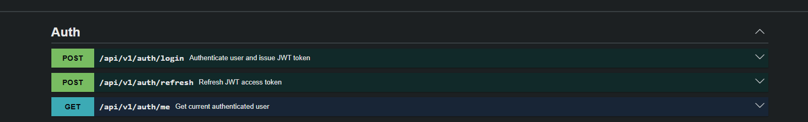

# Лог Результата MR Task 3

## Обзор

Этот документ фиксирует видимый результат текущего merge request, связанного с административной частью и потоком аутентификации.

На скриншотах отражены:
- установка EasyAdmin 5
- настройка формы входа для админки
- доступность dashboard админки
- управление списком пользователей в EasyAdmin
- фильтрация пользователей по группам
- JWT auth endpoints в Swagger UI

## Скриншоты

### Установка EasyAdmin 5

На скриншоте показана стандартная страница EasyAdmin 5 после успешной установки бандла.

### Форма Входа Для Админки

Страница логина доступна для административной зоны и содержит поле email, поле пароля и проверку Cloudflare Turnstile.

### Dashboard Админки

Dashboard админки доступен после успешной аутентификации и служит стартовой точкой для дальнейших административных функций.

### Список Пользователей

Страница списка пользователей доступна в EasyAdmin и показывает настроенные колонки для идентификатора, email, имени, фамилии и ролей вместе с поиском и фильтрами.

### Фильтр Пользователей По Группе

В список пользователей добавлен фильтр по группам. Это позволяет быстро отбирать пользователей по административным и другим рабочим группам прямо из интерфейса EasyAdmin.

### Отфильтрованный Список Пользователей

На скриншоте показан ограниченный список пользователей для обычного пользователя. В таком режиме список показывает только текущего пользователя, что соответствует правилам visibility и гарантирует возможность редактирования только собственного профиля.

### JWT Auth Endpoints

Swagger UI показывает основные JWT endpoints для логина, обновления токена, выхода и получения текущего пользователя.

## Доработки за 2026-04-23

- в административной форме пользователя добавлена смена пароля
- новый пароль в админке сохраняется через хеширование и не записывается в базу в открытом виде
- логика `User::isAdmin()` доработана: теперь она учитывает не только группу `admin`, но и группы с флагом `isAdmin = true`
- добавлен `NewsVoter` для централизованной проверки доступа к просмотру новостей в API
- `NewsVoter` учитывает статус новости и тип пользователя: новости со статусом `public` доступны всем, новости со статусом `internal` доступны авторизованным пользователям, а непубличные новости также доступны администраторам и автору новости
- если доступ к новости запрещен, API скрывает ее существование и возвращает `404`

## Доработки за 2026-04-24

- правила доступа к пользователям были выровнены между админкой и API, поэтому обычный пользователь может безопасно заходить в соответствующие разделы и endpoints и получает только разрешенные данные
- `UsersVoter` теперь разрешает администраторам просматривать и редактировать любого пользователя, а не-админам только собственный профиль
- страница редактирования пользователя в админке теперь явно проверяет voter перед открытием формы
- доступ к группам пользователей централизован через `UserGroupsVoter` и полностью ограничен администраторами
- пункт меню `Groups` в EasyAdmin скрывается, если у текущего пользователя нет доступа к странице списка групп
- в `UserRepository` и `NewsRepository` была упрощена и выровнена логика visibility, root alias и join alias
