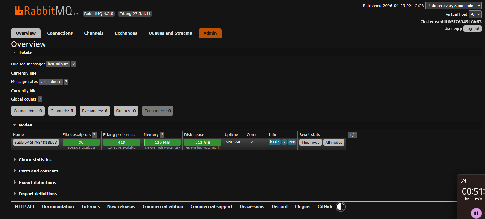
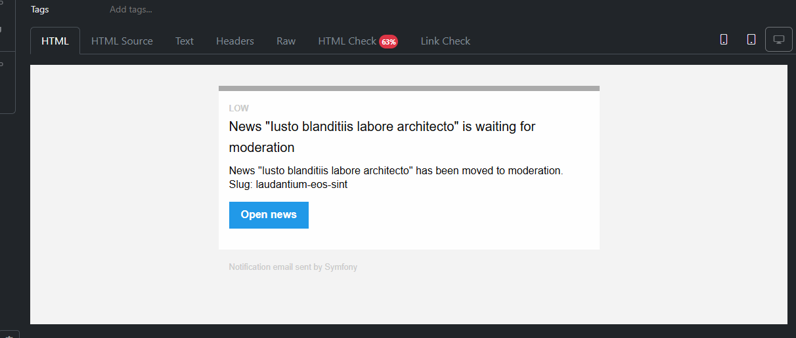

# MR Task 4 Result Log

## Overview

This document captures the visible result of the current merge request related to notification infrastructure and asynchronous email delivery.

The screenshot shows:
- RabbitMQ integration
- RabbitMQ Management UI availability
- AMQP transport preparation for Symfony Messenger
- infrastructure foundation for asynchronous email delivery

## Screenshots

### RabbitMQ Management UI

RabbitMQ with the management UI was added to the project as part of this merge request. The screenshot confirms that RabbitMQ is running and available for inspecting queues, exchanges, connections, and other runtime entities that Symfony Messenger will use for asynchronous message processing.

## Updates for 2026-04-29

- Mailpit was added to the project for local email testing
- `MAILER_DSN` was configured for Symfony Mailer so emails are delivered to Mailpit inside the Docker network
- the external Mailpit SMTP port is not exposed because Symfony talks to the service through the internal Docker network
- the `librabbitmq-dev` system dependency was added to the Symfony CLI PHP image
- the `amqp` PHP extension required by the AMQP transport was added to the Symfony CLI PHP image
- `symfony/messenger` and `symfony/amqp-messenger` were installed
- a RabbitMQ service based on the `rabbitmq:4-management` image was added to Docker Compose
- a persistent RabbitMQ volume was added so broker state survives container restarts
- RabbitMQ Management UI was exposed on port `15672`
- RabbitMQ credentials were moved out of `docker-compose.yml` into the local `.env.local` file
- `.env.local.example` now includes example variables for RabbitMQ and `MESSENGER_TRANSPORT_DSN`
- Messenger now has an asynchronous `async` transport configured through an AMQP DSN
- `Symfony\Component\Mailer\Messenger\SendEmailMessage` is routed to `async`
- the baseline infrastructure check can be done with `mailer:test` and `messenger:consume async`

## Updates for 2026-05-01

### News Moderation Email Notification

The screenshot confirms that the notification for moving a news item to moderation is successfully delivered to Mailpit and rendered as an HTML email based on `NotificationEmail`.

The email includes:
- a subject with the news title
- notification text explaining that the news item was moved to moderation
- the news slug
- an `Open news` action button that links to the news item in the admin panel

This result captures the full local flow: a news status change event creates the notification, Symfony Mailer sends the email, Messenger and RabbitMQ process the delivery asynchronously, and Mailpit provides the final verification point.
