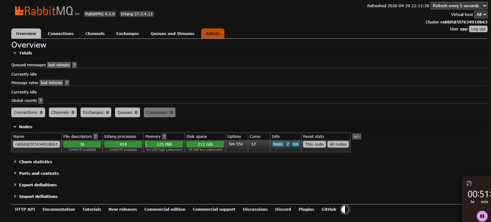
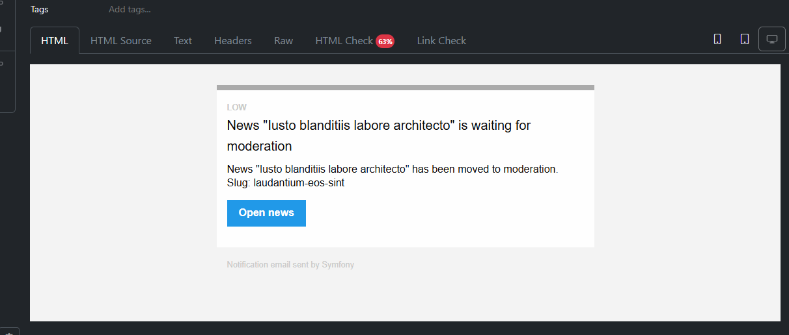
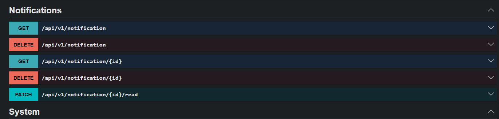

# Лог Результата MR Task 4

<!-- START doctoc generated TOC please keep comment here to allow auto update -->
<!-- DON'T EDIT THIS SECTION, INSTEAD RE-RUN doctoc TO UPDATE -->

- [Обзор](#%D0%BE%D0%B1%D0%B7%D0%BE%D1%80)
- [Скриншоты](#%D1%81%D0%BA%D1%80%D0%B8%D0%BD%D1%88%D0%BE%D1%82%D1%8B)
  - [RabbitMQ Management UI](#rabbitmq-management-ui)
- [Доработки за 2026-04-29](#%D0%B4%D0%BE%D1%80%D0%B0%D0%B1%D0%BE%D1%82%D0%BA%D0%B8-%D0%B7%D0%B0-2026-04-29)
- [Доработки за 2026-05-01](#%D0%B4%D0%BE%D1%80%D0%B0%D0%B1%D0%BE%D1%82%D0%BA%D0%B8-%D0%B7%D0%B0-2026-05-01)
  - [Email-уведомление о новости на модерации](#email-%D1%83%D0%B2%D0%B5%D0%B4%D0%BE%D0%BC%D0%BB%D0%B5%D0%BD%D0%B8%D0%B5-%D0%BE-%D0%BD%D0%BE%D0%B2%D0%BE%D1%81%D1%82%D0%B8-%D0%BD%D0%B0-%D0%BC%D0%BE%D0%B4%D0%B5%D1%80%D0%B0%D1%86%D0%B8%D0%B8)
  - [API endpoints для уведомлений](#api-endpoints-%D0%B4%D0%BB%D1%8F-%D1%83%D0%B2%D0%B5%D0%B4%D0%BE%D0%BC%D0%BB%D0%B5%D0%BD%D0%B8%D0%B9)
  - [Канал Symfony Notifier для entity-уведомлений](#%D0%BA%D0%B0%D0%BD%D0%B0%D0%BB-symfony-notifier-%D0%B4%D0%BB%D1%8F-entity-%D1%83%D0%B2%D0%B5%D0%B4%D0%BE%D0%BC%D0%BB%D0%B5%D0%BD%D0%B8%D0%B9)

<!-- END doctoc -->

## Обзор

Этот документ фиксирует видимый результат текущего merge request, связанного с инфраструктурой уведомлений и асинхронной отправкой email.

На скриншоте отражены:
- подключение RabbitMQ
- доступность RabbitMQ Management UI
- подготовка AMQP transport для Symfony Messenger
- инфраструктурная основа для асинхронной отправки email

## Скриншоты

### RabbitMQ Management UI

В рамках MR в проект был добавлен RabbitMQ с management UI. Скриншот подтверждает, что RabbitMQ запущен и доступен для просмотра очередей, exchanges, connections и других runtime-сущностей, которые будут использоваться Symfony Messenger для асинхронной обработки сообщений.

## Доработки за 2026-04-29

- в проект добавлен Mailpit для локальной проверки email-сообщений
- для Symfony Mailer настроен `MAILER_DSN`, который отправляет письма в Mailpit внутри Docker-сети
- внешний SMTP-порт Mailpit не пробрасывается, так как Symfony обращается к сервису по внутренней Docker-сети
- в PHP-образ Symfony CLI добавлена системная зависимость `librabbitmq-dev`
- в PHP-образ Symfony CLI добавлено расширение `amqp`, необходимое для AMQP transport
- установлены пакеты `symfony/messenger` и `symfony/amqp-messenger`
- в Docker Compose добавлен сервис RabbitMQ на базе образа `rabbitmq:4-management`
- для RabbitMQ добавлен persistent volume, чтобы состояние брокера сохранялось между перезапусками контейнеров
- RabbitMQ Management UI проброшен наружу на порт `15672`
- учетные данные RabbitMQ вынесены из `docker-compose.yml` в локальный файл `.env.local`
- в `.env.local.example` добавлен пример переменных для RabbitMQ и `MESSENGER_TRANSPORT_DSN`
- в Messenger настроен асинхронный transport `async` через AMQP DSN
- отправка `Symfony\Component\Mailer\Messenger\SendEmailMessage` маршрутизируется в `async`
- базовая проверка инфраструктуры выполняется через `mailer:test` и `messenger:consume async`

## Доработки за 2026-05-01

### Email-уведомление о новости на модерации

Скриншот подтверждает, что уведомление о переводе новости в статус модерации успешно доставляется в Mailpit и отображается как HTML-письмо на базе `NotificationEmail`.

Письмо содержит:
- тему с названием новости
- текст уведомления о переводе новости на модерацию
- slug новости
- action-кнопку `Open news`, которая ведет на карточку новости в админке

Этот результат фиксирует полный локальный сценарий: событие изменения статуса новости создает уведомление, письмо отправляется через Symfony Mailer, доставка проходит асинхронно через Messenger и RabbitMQ, а результат можно проверить в Mailpit.

### API endpoints для уведомлений

Скриншот фиксирует Swagger-описание endpoints для работы с уведомлениями текущего пользователя.

В рамках MR были добавлены:
- получение списка уведомлений текущего пользователя
- получение детальной карточки уведомления
- отметка уведомления как прочитанного
- удаление одного уведомления
- удаление всех уведомлений текущего пользователя

Endpoints уведомлений доступны только авторизованным пользователям. Доступ к конкретному уведомлению проверяется через `NotificationsVoter`, поэтому пользователь может просматривать, отмечать прочитанным и удалять только собственные уведомления.

DELETE-запросы дополнительно защищены CSRF-токеном из header `X-CSRF-Token`, который выдается endpoint `GET /api/v1/auth/csrf?id=api_mutation`.

### Канал Symfony Notifier для entity-уведомлений

В рамках MR добавлен отдельный канал Symfony Notifier `notifications`, который позволяет отправлять уведомления в entity `Notifications` через стандартный механизм `NotifierInterface`.

Канал:
- регистрируется как `notifier.channel` через `AutoconfigureTag`
- работает с `UserRecipient`, чтобы сохранить связь уведомления с конкретным `User`
- не создает entity напрямую, а отправляет задачу `CreateNotificationMessage` в Symfony Messenger
- маршрутизирует `CreateNotificationMessage` в async transport
- создает запись `Notifications` в `CreateNotificationMessageHandler`

Такой подход сохраняет интеграцию с Symfony Notifier, но переносит запись уведомлений в БД в Messenger worker и не выполняет тяжелую работу внутри канала.
