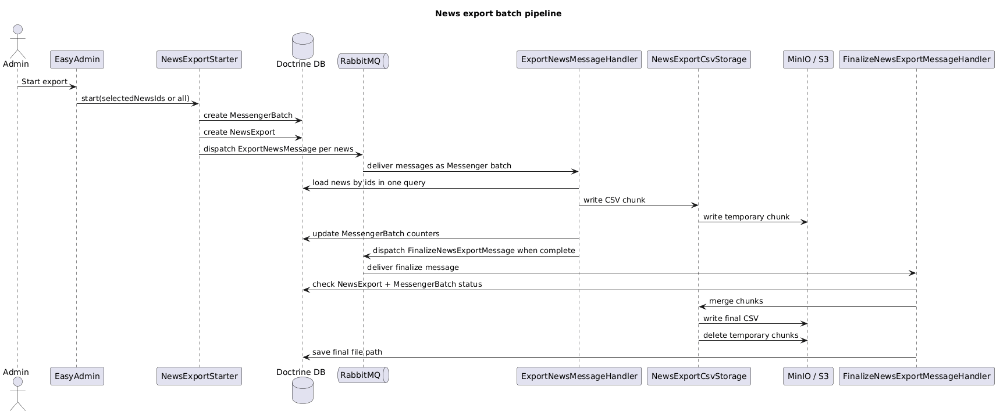
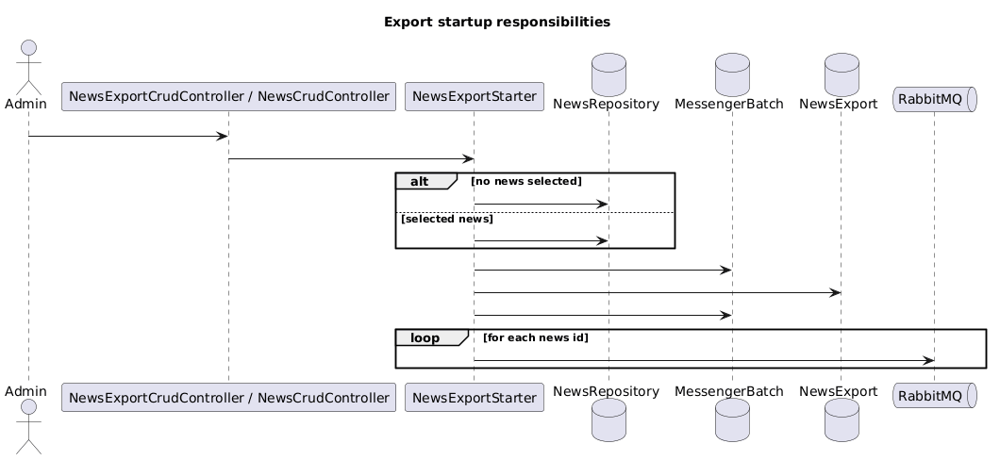
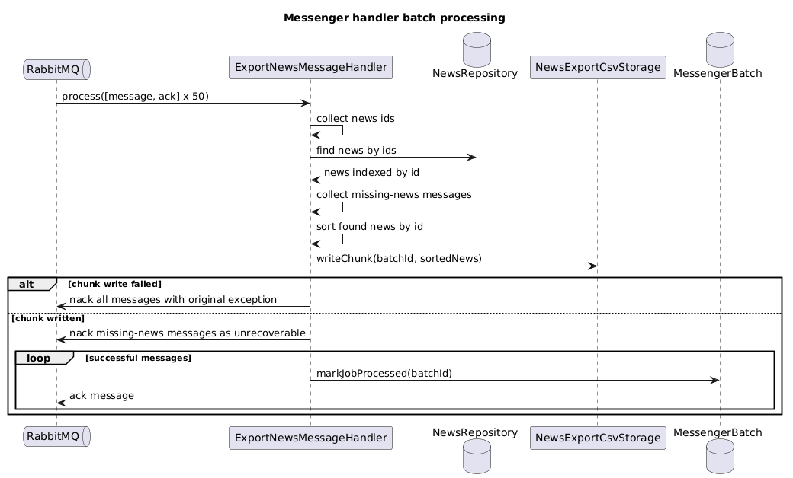
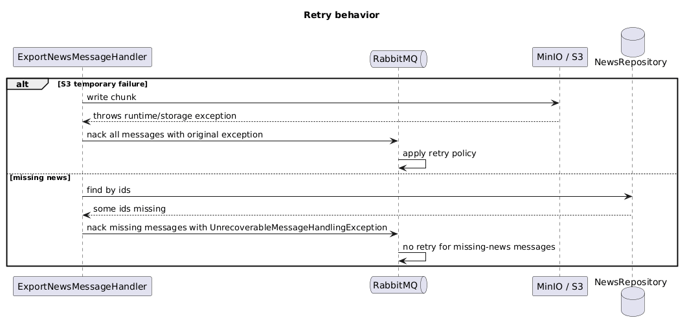
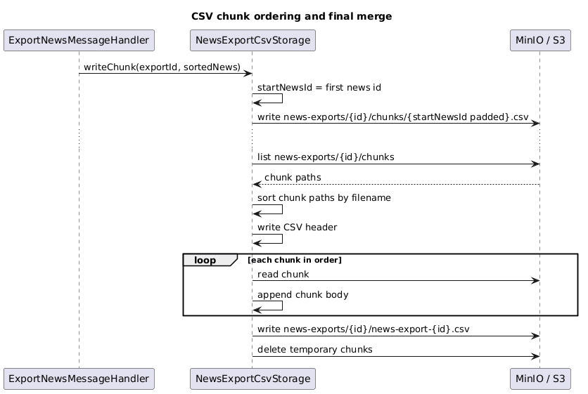
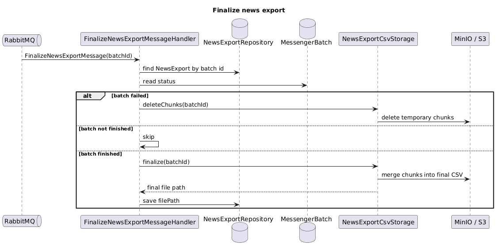
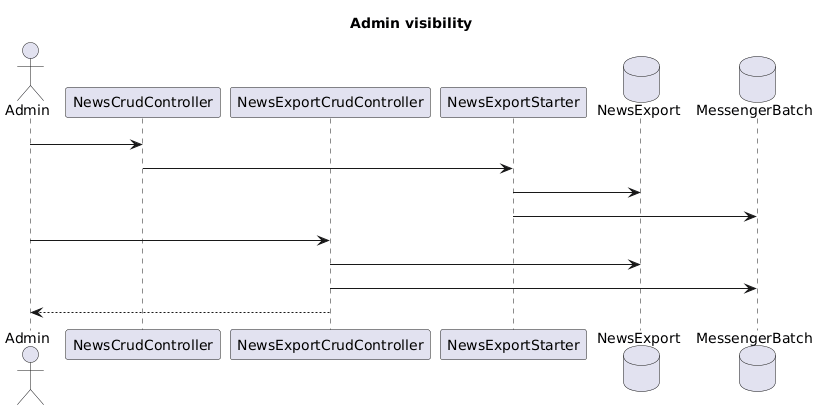
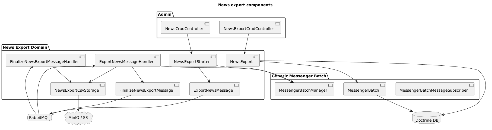

# Лог Результата MR Task 5

## Обзор

Этот документ является заглушкой для видимого результата merge request 5.

Merge request: <https://github.com/ivanserg0692/symfony2026/pull/5>

Задача описывает асинхронный экспорт новостей в S3-compatible storage через Symfony Messenger и RabbitMQ, с MinIO для локальной разработки.

## Планируемый результат

Ожидаемый результат включает:
- интеграцию MinIO в локальное Docker Compose окружение
- настройку S3-compatible storage через переменные окружения
- сценарий запуска экспорта новостей
- асинхронную обработку экспорта через Symfony Messenger и RabbitMQ
- сохранение сформированных файлов экспорта в MinIO/S3
- отслеживание статуса экспорта для успешных и ошибочных задач

## Скриншоты

Скриншоты будут добавлены после того, как реализация будет доступна для визуальной проверки.

## Доработки за 2026-05-02

- подготовлена документация задачи 5
- создана заглушка лога для merge request 5
- в README подготовлены ссылки на файл задачи, merge request и логи результата

## Доработки за 2026-05-05

### Архитектура экспорта новостей через Messenger Batch

Реализация экспорта построена как асинхронный pipeline поверх Symfony Messenger, RabbitMQ, Doctrine и S3-compatible storage. Основная идея: одна новость остается одной message в очереди, но worker обрабатывает messages пачками через `BatchHandlerInterface`, чтобы уменьшить количество запросов к базе и количество операций записи во внешнее хранилище.

Общий pipeline:

- администратор запускает экспорт выбранных новостей или всех новостей
- приложение создает generic batch-запись `MessengerBatch`
- приложение создает доменную запись `NewsExport`, связанную с batch
- в RabbitMQ отправляется по одному `ExportNewsMessage` на каждую новость
- Symfony Messenger worker склеивает messages в handler batch
- handler загружает новости одним запросом и пишет один CSV chunk на пачку
- после завершения всех messages отправляется finalize message
- finalizer объединяет CSV chunks в итоговый CSV и удаляет временные chunks
- путь итогового файла сохраняется в `NewsExport`

<!-- plantuml src="plantuml/news-export/pipeline.puml" alt="News export batch pipeline" out="images/plantuml/news-export/pipeline.png" -->

<!-- /plantuml -->

### Запуск экспорта

Запуск экспорта вынесен в `NewsExportStarter`. Этот сервис не формирует файл и не читает полные новости. Его ответственность ограничена подготовкой выполнения:

- получить список news ids из выбора администратора или загрузить все ids
- нормализовать ids и сохранить порядок по `news.id ASC`
- создать `MessengerBatch` с общим количеством messages
- создать `NewsExport` как доменную запись журнала экспорта
- перевести batch в состояние запуска
- отправить в RabbitMQ один `ExportNewsMessage` на каждую новость

Такой подход оставляет RabbitMQ ответственным за хранение задач, а таблицу `MessengerBatch` использует только для статуса и счетчиков.

<!-- plantuml src="plantuml/news-export/startup.puml" alt="Export startup responsibilities" out="images/plantuml/news-export/startup.png" -->

<!-- /plantuml -->

### Batch-обработка messages

`ExportNewsMessageHandler` реализует `BatchHandlerInterface`. Поэтому message по-прежнему описывает одну новость, но worker обрабатывает несколько messages одним вызовом `process()`.

Внутри одного handler batch:

- собираются `newsId` из всех messages
- новости загружаются одним запросом через repository
- отсутствующие новости собираются отдельно как missing-news messages
- найденные новости сортируются по id
- формируется один CSV chunk на весь handler batch
- успешные messages подтверждаются через `ack`
- missing-news messages получают `nack` с `UnrecoverableMessageHandlingException`

Это снижает нагрузку на выборку новостей: вместо select на каждую message используется один select на batch из 50 messages.

<!-- plantuml src="plantuml/news-export/message-batch-processing.puml" alt="Messenger handler batch processing" out="images/plantuml/news-export/message-batch-processing.png" -->

<!-- /plantuml -->

### Retry и ошибки

Retry зависит от типа exception, который передается в `ack->nack()`.

Если ошибка временная, например недоступен MinIO/S3, handler передает оригинальный exception. Такой exception считается recoverable, и Symfony Messenger применяет retry policy транспорта.

Если ошибка постоянная, например новость с указанным id больше не существует, handler использует `UnrecoverableMessageHandlingException`. Такая message не должна уходить в retry, потому что повторная обработка не исправит отсутствие записи.

<!-- plantuml src="plantuml/news-export/retry.puml" alt="Retry behavior" out="images/plantuml/news-export/retry.png" -->

<!-- /plantuml -->

### CSV chunks и порядок объединения

`NewsExportCsvStorage` отвечает за файловую часть экспорта. Handler передает туда уже отсортированные news entities, а storage:

- извлекает id первой новости в chunk
- использует этот id в имени chunk-файла
- пишет временный CSV chunk в S3-compatible storage
- при финализации находит все chunks
- сортирует пути chunks лексикографически
- объединяет chunks в один CSV с header
- удаляет временные chunks

Имя chunk строится на основе первого `news.id` в пачке с padding. Это сохраняет стабильный порядок объединения, потому что порядок chunks соответствует порядку новостей.

<!-- plantuml src="plantuml/news-export/chunk-merge.puml" alt="CSV chunk ordering and final merge" out="images/plantuml/news-export/chunk-merge.png" -->

<!-- /plantuml -->

### Финализация batch

Финализация вынесена в отдельную message и handler. Это нужно, чтобы сборка итогового файла запускалась только после завершения batch, а не внутри обработки обычной news message.

`FinalizeNewsExportMessageHandler` проверяет состояние связанного `MessengerBatch`:

- если batch failed, временные chunks удаляются, итоговый CSV не создается
- если batch еще не finished, finalizer ничего не делает
- если batch finished, chunks объединяются в итоговый CSV
- путь итогового файла сохраняется в `NewsExport.filePath`

<!-- plantuml src="plantuml/news-export/finalization.puml" alt="Finalize news export" out="images/plantuml/news-export/finalization.png" -->

<!-- /plantuml -->

### Админка и видимость результата

`NewsExport` используется как доменная запись журнала экспорта. Она связана с generic `MessengerBatch`, поэтому админка может показывать состояние экспорта без чтения очереди RabbitMQ.

В админке:

- список новостей позволяет запустить экспорт выбранных записей
- если ничего не выбрано, запускается экспорт всех новостей
- список экспортов показывает состояние batch и путь итогового файла
- CRUD экспорта сделан read-only, потому что запись отражает состояние фонового процесса

<!-- plantuml src="plantuml/news-export/admin-visibility.puml" alt="Admin visibility" out="images/plantuml/news-export/admin-visibility.png" -->

<!-- /plantuml -->

### Разделение ответственности

Архитектура получилась многокомпонентной, потому что разные части pipeline имеют разные источники ошибок и разные side effects:

- `NewsExportStarter` создает batch и наполняет RabbitMQ messages
- `ExportNewsMessage` описывает одну новость для экспорта
- `ExportNewsMessageHandler` группирует messages, загружает новости и пишет CSV chunks
- `FinalizeNewsExportMessage` запускает финальную сборку
- `FinalizeNewsExportMessageHandler` завершает экспорт или очищает chunks при failed batch
- `NewsExportCsvStorage` инкапсулирует CSV, chunk paths, final path и S3-compatible storage
- `MessengerBatch` хранит generic состояние batch
- `NewsExport` связывает generic batch с доменной задачей экспорта новостей

<!-- plantuml src="plantuml/news-export/components.puml" alt="News export components" out="images/plantuml/news-export/components.png" -->

<!-- /plantuml -->
