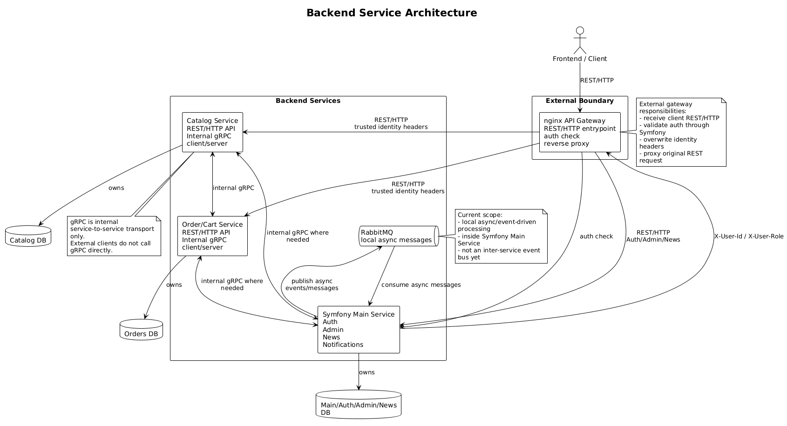

# Лог Результата MR Task 7

## Обзор

Этот документ будет описывать видимый результат merge request 7.

Merge request: TBD

Файл задачи: [task-7.md](task-7.md)

Задача описывает и подготавливает целевую архитектуру backend-сервисов, где nginx является внешним REST/HTTP API Gateway, существующее Symfony-приложение является основным сервисом для Auth, админки, новостей и уведомлений, а gRPC используется только для внутренних service-to-service взаимодействий.

## Планируемый результат

Ожидаемый результат включает:
- nginx как внешний REST/HTTP gateway
- auth check от nginx к Symfony Main Service
- trusted identity headers `X-User-Id` и `X-User-Role`
- проксирование REST/HTTP запросов от nginx в downstream backend-сервисы
- внутреннее gRPC-взаимодействие между backend-сервисами там, где оно нужно
- отдельное владение базой данных каждым сервисом
- локальную async/event-driven обработку внутри Symfony Main Service через RabbitMQ
- зафиксированный будущий путь для расширения уведомлений и event-driven интеграций

## Архитектурная диаграмма

<!-- plantuml src="plantuml/backend-architecture/services.puml" alt="Backend service architecture" out="images/plantuml/backend-architecture/services.png" -->

<!-- /plantuml -->

## Скриншоты

Не применимо для архитектурной задачи по документации.

## Обновления

Заметки по реализации будут добавляться сюда отдельными датированными секциями.
