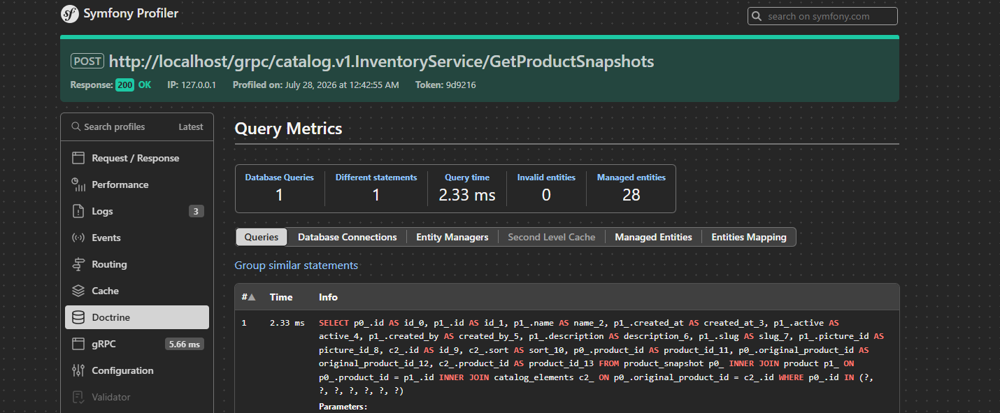
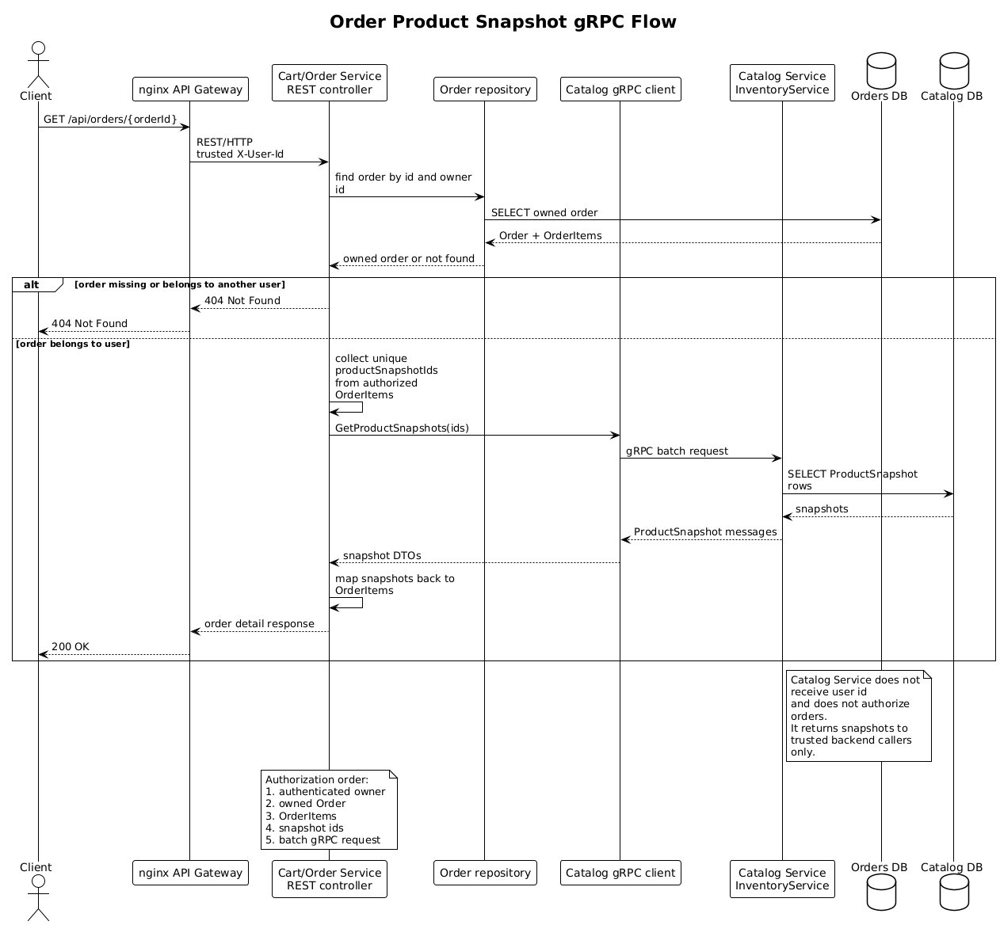

# MR Task 7.2 Result Log

<!-- START doctoc generated TOC please keep comment here to allow auto update -->
<!-- DON'T EDIT THIS SECTION, INSTEAD RE-RUN doctoc TO UPDATE -->

- [Overview](#overview)
- [Scope](#scope)
- [Target Endpoints](#target-endpoints)
- [Out Of Scope](#out-of-scope)
- [Security Notes](#security-notes)
- [Screenshots](#screenshots)
- [Updates](#updates)
  - [2026-07-29](#2026-07-29)

<!-- END doctoc -->

## Overview

This document describes the visible result of merge request 10.

Merge request: https://github.com/ivanserg0692/symfony2026/pull/10

Task file: [task-7.2.md](task-7.2.md)

The merge request continues Task 7.2 and focuses on Cart/Order Service endpoints that require internal gRPC integration with Catalog Service.

## Scope

The expected result includes:

- gRPC-based Catalog Service integration for Cart/Order flows;
- internal service-to-service communication only;
- REST/HTTP external access through nginx/API layer;
- unchanged behavior for endpoints that are already complete without gRPC.

## Target Endpoints

Endpoints covered by this task:

- `POST /api/cart/items` - validate product existence, availability, price, and stock before adding a cart item.
- `PATCH /api/cart/items/{itemId}` - validate requested quantity against Catalog Service data before updating a cart item.
- `GET /api/orders/{orderId}` - check order ownership first, then load required catalog details/snapshots through gRPC.

## Out Of Scope

The following endpoints are tracked separately:

- `POST /api/orders` - requires a separate RabbitMQ/event-driven flow.
- `POST /api/orders/{orderId}/cancel` - requires a separate cancel flow.

Already completed endpoints without gRPC remain outside this implementation scope:

- `GET /api/cart`;
- `DELETE /api/cart/items/{itemId}`;
- `DELETE /api/cart`;
- `GET /api/orders`.

## Security Notes

`GET /api/orders/{orderId}` must not call Catalog Service before verifying that the order belongs to the current user. This prevents loading or exposing catalog-related details for another user's order.

## Screenshots

Catalog gRPC performance profiler:

Order product snapshot gRPC flow:

<!-- plantuml src="plantuml/grpc-contracts/order-snapshot-flow.puml" alt="Order product snapshot gRPC flow" out="images/plantuml/grpc-contracts/order-snapshot-flow.png" -->

<!-- /plantuml -->

## Updates

Implementation notes will be appended here as dated sections.

### 2026-07-29

Task 7.2 is complete for the backend MR scope.

Added:

- Cart/Order Service calls Catalog Service through gRPC for cart add/update validation and order detail snapshot loading.
- `GET /api/orders/{orderId}` first verifies order ownership, then collects `productSnapshotId` values only from `OrderItems` of the authorized order and performs one batch `GetProductSnapshots` call.
- `GET /api/orders` remains a lightweight paginated list without full item and snapshot loading.
- Product snapshot data is exposed through the order detail response and is not available through a standalone public REST endpoint.
- Historical order output is built from snapshot data; current Product data is not used to reconstruct order product fields.
- Order prices remain stored in `OrderItem`, so missing price fields in snapshots are not an issue.
- Catalog gRPC performance logging and profiler view were added to expose handler time, profiler save time, and total processing time.
- Cart add/update and checkout paths were tightened with transaction/locking behavior around operations that read and mutate cart state.

Related documentation:

- gRPC contracts: [grpc-contracts/README.md](../../grpc-contracts/README.md).
- Proto source: [inventory.proto](../../grpc-contracts/catalog/v1/inventory.proto).
