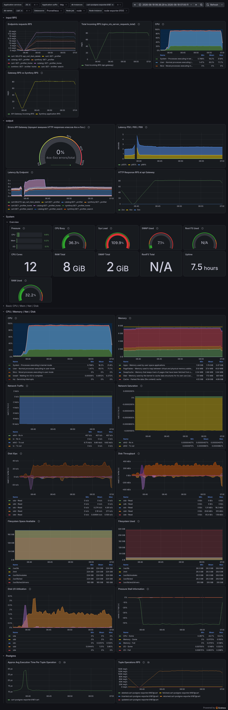

# MR Result Log Task 8

<!-- START doctoc generated TOC please keep comment here to allow auto update -->
<!-- DON'T EDIT THIS SECTION, INSTEAD RE-RUN doctoc TO UPDATE -->

- [Summary](#summary)
- [Scope](#scope)
- [Monitoring Scope](#monitoring-scope)
- [Load Testing Scope](#load-testing-scope)
- [Verification Plan](#verification-plan)
- [Out Of Scope](#out-of-scope)
- [2026-08-19 - Task Completion](#2026-08-19---task-completion)

<!-- END doctoc -->

## Summary

This document describes the planned merge request result for Task 8.

Merge request: TBD

Task file: [task-8.md](task-8.md)

The planned merge request introduces monitoring and load testing for the online store. The goal is to make the main runtime components observable, run realistic load scenarios, and identify stable throughput, latency degradation points, errors under load, and likely bottlenecks.

## Scope

Planned:

- introduce Prometheus metrics collection for the main monitored components;
- add Grafana visualization for application, gateway, database, and system metrics;
- add k6 load testing scenarios that simulate realistic online store user behavior;
- cover both anonymous and authenticated user flows;
- measure RPS, latency, p50, p95, p99, HTTP/gRPC errors, CPU, RAM, PostgreSQL activity, and API Gateway metrics;
- correlate load test results with service-level and resource-level metrics.

## Monitoring Scope

The monitoring scope must cover:

- Nginx/API Gateway metrics;
- Symfony HTTP metrics for the main Symfony service;
- Symfony HTTP metrics for Catalog Service;
- Symfony HTTP metrics for Cart/Order Service;
- dedicated Prometheus metrics for internal gRPC calls;
- PostgreSQL connection and activity metrics;
- CPU, RAM, and other required system metrics;
- per-service load and error metrics.

## Load Testing Scope

k6 scenarios must model real online store behavior instead of isolated endpoint checks.

Planned scenarios include:

- catalog browsing;
- product search;
- product detail views;
- cart operations;
- checkout/order creation flows;
- authenticated user actions with different users.

Load profiles must gradually increase traffic to identify:

- maximum stable RPS;
- when latency degradation starts;
- error count under load;
- the component that becomes the bottleneck;
- server resource usage at different load levels.

## Verification Plan

The implementation should be verified by checking that:

- every important component has a defined metrics source;
- Prometheus can collect application, gateway, database, gRPC, and system metrics;
- Grafana dashboards can correlate traffic, latency, errors, and resource usage;
- k6 scenarios cover realistic online store flows;
- load profiles can identify stable throughput and degradation points;
- test results can name the likely bottleneck for each load level.

## Out Of Scope

This planned task does not define concrete installation commands, Docker configuration, Prometheus scrape configuration, Grafana dashboard JSON, or k6 scripts yet.

Business logic changes in the services are out of scope unless they are separately approved during implementation.

## 2026-08-19 - Task Completion

Monitoring and load testing have been implemented. Docker Compose now includes Prometheus, Grafana, Grafana Image Renderer, the Nginx VTS exporter, Node Exporter, and dedicated PostgreSQL exporters for the main database, Catalog Service, and Cart/Order Service.

Prometheus collects metrics from the following monitored nodes:

- API Gateway and Nginx;
- the main Symfony service;
- Catalog Service;
- Cart/Order Service;
- the main, catalog, and cart PostgreSQL databases;
- host resources: CPU, RAM, swap, filesystem, disk I/O, and network.

A consolidated Grafana dashboard was built with the following panel groups:

- incoming API Gateway RPS, Symfony service RPS, and per-endpoint RPS;
- HTTP responses by status class and the API Gateway error percentage;
- p50, p95, and p99 latency, plus per-endpoint p95 latency;
- CPU, RAM, swap, system load, uptime, and PSI resource pressure;
- filesystem usage, disk throughput, IOPS, and disk utilization;
- incoming and outgoing network traffic and network saturation;
- PostgreSQL tuple operations and approximate average execution time per tuple operation.

k6 scenarios were added for catalog browsing, the shopping flow, checkout, and mixed traffic. The scenarios support authenticated users and allow load test results to be correlated with Grafana metrics.

The current intermediate load test result is approximately **80 RPS**. This is a preliminary measurement, not the confirmed maximum stable capacity of the system. Further RPS optimization and bottleneck analysis will continue separately from the completed monitoring task.

The dashboard screenshot shows a load test interval where incoming traffic through API Gateway and the Symfony services can be correlated with latency, HTTP errors, PostgreSQL activity, and system resource usage. These panels make it possible to identify the layer where degradation starts as load increases.

