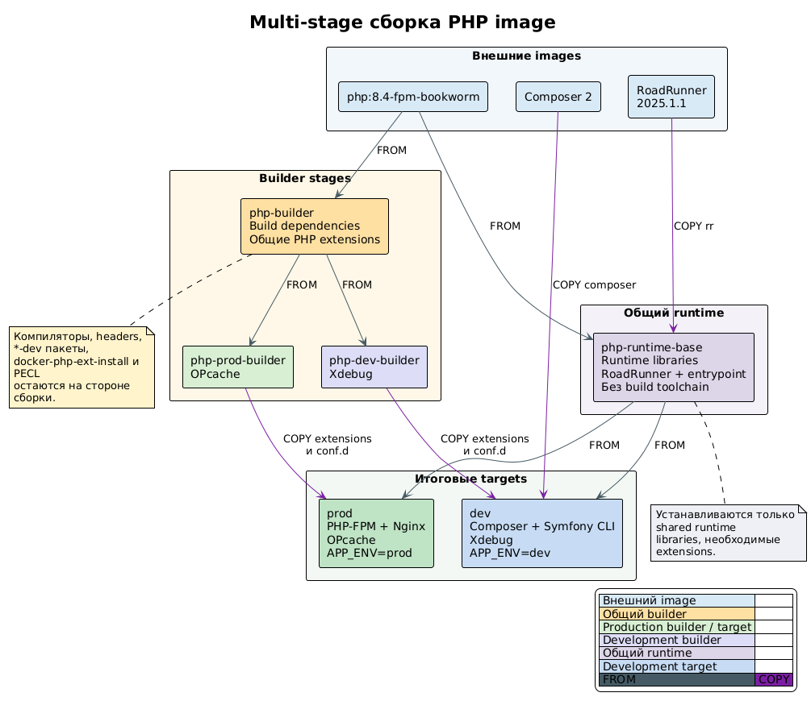

# PHP Multi-stage Image Build

<!-- START doctoc generated TOC please keep comment here to allow auto update -->
<!-- DON'T EDIT THIS SECTION, INSTEAD RE-RUN doctoc TO UPDATE -->

- [English](#english)
  - [Purpose](#purpose)
  - [Stage Graph](#stage-graph)
  - [Build Stages](#build-stages)
  - [Extension and System Package Chain](#extension-and-system-package-chain)
  - [Artifact Flow](#artifact-flow)
  - [ABI and Shared Library Requirements](#abi-and-shared-library-requirements)
  - [Final Production Image](#final-production-image)
  - [Final Development Image](#final-development-image)
  - [Docker Compose Targets](#docker-compose-targets)
  - [Layer Cache](#layer-cache)
  - [Maintenance Rules](#maintenance-rules)
  - [Verification](#verification)
  - [Project References](#project-references)
- [Русский](#%D1%80%D1%83%D1%81%D1%81%D0%BA%D0%B8%D0%B9)
  - [Назначение](#%D0%BD%D0%B0%D0%B7%D0%BD%D0%B0%D1%87%D0%B5%D0%BD%D0%B8%D0%B5)
  - [Граф stages](#%D0%B3%D1%80%D0%B0%D1%84-stages)
  - [Stages сборки](#stages-%D1%81%D0%B1%D0%BE%D1%80%D0%BA%D0%B8)
  - [Цепочка PHP extensions и системных пакетов](#%D1%86%D0%B5%D0%BF%D0%BE%D1%87%D0%BA%D0%B0-php-extensions-%D0%B8-%D1%81%D0%B8%D1%81%D1%82%D0%B5%D0%BC%D0%BD%D1%8B%D1%85-%D0%BF%D0%B0%D0%BA%D0%B5%D1%82%D0%BE%D0%B2)
  - [Перенос артефактов](#%D0%BF%D0%B5%D1%80%D0%B5%D0%BD%D0%BE%D1%81-%D0%B0%D1%80%D1%82%D0%B5%D1%84%D0%B0%D0%BA%D1%82%D0%BE%D0%B2)
  - [Требования ABI и shared libraries](#%D1%82%D1%80%D0%B5%D0%B1%D0%BE%D0%B2%D0%B0%D0%BD%D0%B8%D1%8F-abi-%D0%B8-shared-libraries)
  - [Итоговый production image](#%D0%B8%D1%82%D0%BE%D0%B3%D0%BE%D0%B2%D1%8B%D0%B9-production-image)
  - [Итоговый development image](#%D0%B8%D1%82%D0%BE%D0%B3%D0%BE%D0%B2%D1%8B%D0%B9-development-image)
  - [Docker Compose targets](#docker-compose-targets-1)
  - [Layer cache](#layer-cache-1)
  - [Правила сопровождения](#%D0%BF%D1%80%D0%B0%D0%B2%D0%B8%D0%BB%D0%B0-%D1%81%D0%BE%D0%BF%D1%80%D0%BE%D0%B2%D0%BE%D0%B6%D0%B4%D0%B5%D0%BD%D0%B8%D1%8F)
  - [Проверка](#%D0%BF%D1%80%D0%BE%D0%B2%D0%B5%D1%80%D0%BA%D0%B0)
  - [Проектные ссылки](#%D0%BF%D1%80%D0%BE%D0%B5%D0%BA%D1%82%D0%BD%D1%8B%D0%B5-%D1%81%D1%81%D1%8B%D0%BB%D0%BA%D0%B8)

<!-- END doctoc -->

## English

### Purpose

The PHP image is built from `docker/php-symfony-cli/Dockerfile`. One Dockerfile produces separate production and development targets while keeping compilers, headers, and `*-dev` packages outside the final runtime images.

The build preserves the shared PHP extension set: `intl`, `mbstring`, `pdo_pgsql`, `sockets`, `amqp`, `grpc`, `redis`, `xsl`, and `zip`. OPcache is added only to `prod`; Xdebug, Composer, and Symfony CLI are added only to `dev`.

### Stage Graph

<!-- plantuml src="plantuml/php-multi-stage-build/stages.puml" alt="PHP multi-stage image build" out="images/plantuml/php-multi-stage-build/stages.png" -->

<!-- /plantuml -->

### Build Stages

| Stage | Parent image or stage | Responsibility | Output consumed by |
| --- | --- | --- | --- |
| `roadrunner` | `ghcr.io/roadrunner-server/roadrunner:2025.1.1` | Provides the `rr` binary as an external build artifact. | `php-runtime-base` |
| `php-builder` | `php:8.4-fpm-bookworm` | Installs build headers and compiles all PHP extensions shared by production and development. | `php-prod-builder`, `php-dev-builder` |
| `php-prod-builder` | `php-builder` | Compiles OPcache on top of the shared extension set. | `prod` |
| `php-dev-builder` | `php-builder` | Compiles and enables Xdebug on top of the shared extension set. | `dev` |
| `php-runtime-base` | `php:8.4-fpm-bookworm` | Installs runtime libraries, removes the confirmed build toolchain and PHP build helpers, and adds RoadRunner and the common entrypoint. | `prod`, `dev` |
| `prod` | `php-runtime-base` | Adds production extensions, Nginx, OPcache, PHP-FPM configuration, and the production server script. | Production Compose services |
| `dev` | `php-runtime-base` | Adds development extensions, Composer, Symfony CLI, Xdebug configuration, Git, and archive/download tools. | Development Compose services |

### Extension and System Package Chain

`php-builder` installs the following headers only for compilation:

| Build package | Compiled extension | Runtime package retained in final images |
| --- | --- | --- |
| `libicu-dev` | `intl` | `libicu72` |
| `libonig-dev` | `mbstring` | `libonig5` |
| `libpq-dev` | `pdo_pgsql` | `libpq5` |
| `librabbitmq-dev` | PECL `amqp` | `librabbitmq4` |
| `libxslt1-dev` | `xsl` | `libxslt1.1` |
| `libzip-dev` | `zip` | `libzip4` |

The shared runtime also retains `libstdc++6`, `zlib1g`, and the libraries already supplied by the common PHP base image for the compiled PECL and core extensions. `bash`, `ca-certificates`, `curl`, and `xz-utils` support the existing container entrypoint and runtime tooling.

### Artifact Flow

The builder stages produce two types of PHP artifacts:

- extension shared objects under `/usr/local/lib/php/extensions/`;
- extension loading configuration under `/usr/local/etc/php/conf.d/`.

`prod` copies both directories from `php-prod-builder`, so it receives the common extensions plus OPcache. `dev` copies them from `php-dev-builder`, so it receives the common extensions plus Xdebug. The application source is not baked into these image targets; Compose mounts each Symfony service into `/workspace`.

RoadRunner is copied from the pinned `roadrunner` image into `php-runtime-base`. Composer is copied from `composer:2` directly into `dev`. Symfony CLI is downloaded and installed only while building `dev`.

### ABI and Shared Library Requirements

Copying the compiled `.so` files is safe only while the builder and runtime stages use the same PHP version, extension API, operating-system family, CPU architecture, and compatible shared libraries. The current stages all use `php:8.4-fpm-bookworm`, so they share the PHP ABI and Debian Bookworm library family.

The tag is still mutable. When the base image or PHP patch version changes, rebuild every stage together and verify the copied modules with `php -m`, `php --ri`, and `ldd`. Never solve a missing runtime library by copying a `*-dev` package into the final image; install the matching runtime package instead.

### Final Production Image

The `prod` target physically contains:

- PHP 8.4 FPM and CLI from the common base image;
- RoadRunner and the common entrypoint;
- the required common PHP extensions and OPcache;
- shared runtime libraries needed by those extensions;
- Nginx and the production Nginx/PHP-FPM/OPcache configuration;
- the production web-server script.

It does not intentionally contain Xdebug, Composer, Symfony CLI, Git, PHP headers, `phpize`, `php-config`, extension build helpers, compilers, or the listed `*-dev` packages.

### Final Development Image

The `dev` target contains the common runtime and PHP extensions plus Xdebug, Composer, Symfony CLI, Git, `unzip`, and `wget`. It does not inherit OPcache from `php-prod-builder`.

### Docker Compose Targets

Production is the default configuration in `docker-compose.yml` and selects `target: prod`. Development loads `.env.dev`, which adds `docker-compose.dev.yml` through `COMPOSE_FILE`; the override selects `target: dev` for the PHP services. Load testing loads `.env.load_test`, adds `docker-compose.load-test.yml`, and selects `target: load-test` while keeping `APP_ENV=prod` and `APP_DEBUG=0`.

```bash
# Activate production, then inspect and build it
set -a
. ./.env
set +a
docker compose config
docker compose build symfony-cli

# Activate development, then inspect and build it
set -a
. ./.env
. ./.env.dev
set +a
docker compose config
docker compose build symfony-cli

# Activate load testing, then inspect it
set -a
. ./.env
. ./.env.load_test
set +a
docker compose config
```

The selected variables remain exported for subsequent `docker compose` and npm commands in the same terminal. Repeat activation in every new shell. `set +a` does not unset the loaded variables.

### Layer Cache

The shared extensions are compiled once in `php-builder` and reused by both specialized builders. Changes to application source mounted by Compose do not invalidate image layers. Changes to the base PHP image, apt package list, or common extension installation invalidate both target branches. Changes limited to OPcache affect only the production branch; changes limited to Xdebug or development tools affect only the development branch.

### Maintenance Rules

When adding or updating a PHP extension:

1. Decide whether it belongs to both targets, production only, or development only.
2. Install headers and compilers only in the relevant builder stage.
3. Identify the runtime shared libraries using `ldd` and install their non-`*-dev` packages in the runtime stage.
4. Keep builder and runtime stages on an ABI-compatible PHP base.
5. Rebuild and verify both Compose targets.
6. Confirm that production still contains no missing libraries or development-only tooling.

### Verification

After rebuilding the images, verify at least:

```bash
# Activate production
set -a
. ./.env
set +a

# Loaded production extensions and OPcache
docker compose run --rm symfony-cli php -m
docker compose run --rm symfony-cli php --ri opcache

# Xdebug must be absent from production
docker compose run --rm symfony-cli php --ri xdebug

# Activate development
set -a
. ./.env
. ./.env.dev
set +a

# Loaded development extensions and Xdebug
docker compose run --rm symfony-cli php -m
docker compose run --rm symfony-cli php --ri xdebug
```

Use `ldd` on the critical extension `.so` files in both targets and confirm that it reports no `not found` entries. Also inspect the production package list and command paths to confirm that compilers, headers, `*-dev` packages, Composer, Symfony CLI, and Xdebug are absent.

### Project References

- [PHP Dockerfile](../../docker/php-symfony-cli/Dockerfile)
- [Production Compose configuration](../../docker-compose.yml)
- [Development Compose override](../../docker-compose.dev.yml)
- [Production OPcache configuration](../../docker/php-symfony-cli/opcache-prod.ini)
- [Production PHP-FPM configuration](../../docker/php-symfony-cli/php-fpm-prod.conf)
- [Production Nginx configuration](../../docker/php-symfony-cli/nginx-prod.conf)
- [Development Xdebug configuration](../../docker/php-symfony-cli/xdebug.ini)
- [Task 9](task-9.md)
- [Pull Request 13](https://github.com/ivanserg0692/symfony2026/pull/13)

## Русский

### Назначение

PHP image собирается из `docker/php-symfony-cli/Dockerfile`. Один Dockerfile формирует отдельные production- и development-targets, при этом компиляторы, headers и `*-dev` пакеты не попадают в итоговые runtime images.

Сборка сохраняет общий набор PHP extensions: `intl`, `mbstring`, `pdo_pgsql`, `sockets`, `amqp`, `grpc`, `redis`, `xsl` и `zip`. OPcache добавляется только в `prod`, а Xdebug, Composer и Symfony CLI — только в `dev`.

### Граф stages

<!-- plantuml src="plantuml/php-multi-stage-build-ru/stages.puml" alt="Multi-stage сборка PHP image" out="images/plantuml/php-multi-stage-build-ru/stages.png" -->

<!-- /plantuml -->

### Stages сборки

| Stage | Родительский image или stage | Ответственность | Кто использует результат |
| --- | --- | --- | --- |
| `roadrunner` | `ghcr.io/roadrunner-server/roadrunner:2025.1.1` | Предоставляет бинарный файл `rr` как внешний build artifact. | `php-runtime-base` |
| `php-builder` | `php:8.4-fpm-bookworm` | Устанавливает build headers и компилирует общий для production и development набор PHP extensions. | `php-prod-builder`, `php-dev-builder` |
| `php-prod-builder` | `php-builder` | Компилирует OPcache поверх общего набора extensions. | `prod` |
| `php-dev-builder` | `php-builder` | Компилирует и включает Xdebug поверх общего набора extensions. | `dev` |
| `php-runtime-base` | `php:8.4-fpm-bookworm` | Устанавливает runtime libraries, удаляет подтвержденный build toolchain и PHP build helpers, добавляет RoadRunner и общий entrypoint. | `prod`, `dev` |
| `prod` | `php-runtime-base` | Добавляет production extensions, Nginx, OPcache, PHP-FPM configuration и production server script. | Production Compose services |
| `dev` | `php-runtime-base` | Добавляет development extensions, Composer, Symfony CLI, Xdebug configuration, Git и инструменты архивирования/загрузки. | Development Compose services |

### Цепочка PHP extensions и системных пакетов

`php-builder` устанавливает следующие headers только для компиляции:

| Build package | Собираемый extension | Runtime package в итоговых images |
| --- | --- | --- |
| `libicu-dev` | `intl` | `libicu72` |
| `libonig-dev` | `mbstring` | `libonig5` |
| `libpq-dev` | `pdo_pgsql` | `libpq5` |
| `librabbitmq-dev` | PECL `amqp` | `librabbitmq4` |
| `libxslt1-dev` | `xsl` | `libxslt1.1` |
| `libzip-dev` | `zip` | `libzip4` |

Общий runtime также сохраняет `libstdc++6`, `zlib1g` и библиотеки, уже предоставленные общим PHP base image для собранных PECL и core extensions. `bash`, `ca-certificates`, `curl` и `xz-utils` поддерживают существующий entrypoint и runtime tooling контейнера.

### Перенос артефактов

Builder stages формируют два типа PHP artifacts:

- shared objects расширений в `/usr/local/lib/php/extensions/`;
- конфигурацию загрузки расширений в `/usr/local/etc/php/conf.d/`.

`prod` копирует оба каталога из `php-prod-builder` и поэтому получает общие extensions вместе с OPcache. `dev` копирует их из `php-dev-builder` и получает общие extensions вместе с Xdebug. Исходный код приложения не встраивается в эти targets: Compose монтирует каждый Symfony service в `/workspace`.

RoadRunner копируется из закрепленного `roadrunner` image в `php-runtime-base`. Composer копируется из `composer:2` непосредственно в `dev`. Symfony CLI загружается и устанавливается только во время сборки `dev`.

### Требования ABI и shared libraries

Копирование собранных `.so` безопасно только тогда, когда builder и runtime stages используют одинаковые версию PHP, extension API, семейство операционной системы, архитектуру CPU и совместимые shared libraries. Сейчас все stages используют `php:8.4-fpm-bookworm`, поэтому имеют общий PHP ABI и семейство библиотек Debian Bookworm.

При этом tag остается изменяемым. После изменения base image или patch-версии PHP необходимо совместно пересобрать все stages и проверить скопированные modules с помощью `php -m`, `php --ri` и `ldd`. Нельзя исправлять отсутствующую runtime library переносом `*-dev` пакета в итоговый image — вместо него устанавливается соответствующий runtime package.

### Итоговый production image

Target `prod` физически содержит:

- PHP 8.4 FPM и CLI из общего base image;
- RoadRunner и общий entrypoint;
- требуемые общие PHP extensions и OPcache;
- shared runtime libraries, необходимые этим extensions;
- Nginx и production-конфигурации Nginx/PHP-FPM/OPcache;
- production web-server script.

В нем намеренно отсутствуют Xdebug, Composer, Symfony CLI, Git, PHP headers, `phpize`, `php-config`, helpers сборки extensions, компиляторы и перечисленные `*-dev` пакеты.

### Итоговый development image

Target `dev` содержит общий runtime и PHP extensions, а также Xdebug, Composer, Symfony CLI, Git, `unzip` и `wget`. OPcache из `php-prod-builder` им не наследуется.

### Docker Compose targets

Production является конфигурацией по умолчанию в `docker-compose.yml` и выбирает `target: prod`. Development загружает `.env.dev`, который через `COMPOSE_FILE` подключает `docker-compose.dev.yml`; override выбирает `target: dev` для PHP services. Load-test загружает `.env.load_test`, подключает `docker-compose.load-test.yml` и выбирает `target: load-test`, сохраняя `APP_ENV=prod` и `APP_DEBUG=0`.

```bash
# Активировать production, затем проверить и собрать его
set -a
. ./.env
set +a
docker compose config
docker compose build symfony-cli

# Активировать development, затем проверить и собрать его
set -a
. ./.env
. ./.env.dev
set +a
docker compose config
docker compose build symfony-cli

# Активировать load-test, затем проверить его
set -a
. ./.env
. ./.env.load_test
set +a
docker compose config
```

Выбранные переменные остаются экспортированными для следующих команд `docker compose` и npm в текущем терминале. Активацию нужно повторять в каждой новой shell-сессии. `set +a` не удаляет загруженные переменные.

### Layer cache

Общие extensions компилируются один раз в `php-builder` и переиспользуются обоими специализированными builders. Изменения исходного кода приложения, подключаемого через Compose volume, не инвалидируют image layers. Изменение PHP base image, списка apt packages или сборки общих extensions инвалидирует обе target-ветки. Изменения только OPcache затрагивают production-ветку, а изменения Xdebug или development tools — только development-ветку.

### Правила сопровождения

При добавлении или обновлении PHP extension необходимо:

1. Определить, требуется ли он обоим targets, только production или только development.
2. Установить headers и компиляторы только в соответствующем builder stage.
3. Определить runtime shared libraries через `ldd` и установить их пакеты без суффикса `*-dev` в runtime stage.
4. Сохранить ABI-совместимый PHP base для builder и runtime stages.
5. Пересобрать и проверить оба Compose targets.
6. Убедиться, что в production по-прежнему отсутствуют недостающие libraries и development tooling.

### Проверка

После пересборки images необходимо проверить как минимум:

```bash
# Активировать production
set -a
. ./.env
set +a

# Загруженные production extensions и OPcache
docker compose run --rm symfony-cli php -m
docker compose run --rm symfony-cli php --ri opcache

# Xdebug должен отсутствовать в production
docker compose run --rm symfony-cli php --ri xdebug

# Активировать development
set -a
. ./.env
. ./.env.dev
set +a

# Загруженные development extensions и Xdebug
docker compose run --rm symfony-cli php -m
docker compose run --rm symfony-cli php --ri xdebug
```

Для критичных `.so` extensions нужно выполнить `ldd` в обоих targets и убедиться, что вывод не содержит `not found`. Также следует проверить список production packages и доступные команды, чтобы подтвердить отсутствие компиляторов, headers, `*-dev` packages, Composer, Symfony CLI и Xdebug.

### Проектные ссылки

- [PHP Dockerfile](../../docker/php-symfony-cli/Dockerfile)
- [Production Compose configuration](../../docker-compose.yml)
- [Development Compose override](../../docker-compose.dev.yml)
- [Production OPcache configuration](../../docker/php-symfony-cli/opcache-prod.ini)
- [Production PHP-FPM configuration](../../docker/php-symfony-cli/php-fpm-prod.conf)
- [Production Nginx configuration](../../docker/php-symfony-cli/nginx-prod.conf)
- [Development Xdebug configuration](../../docker/php-symfony-cli/xdebug.ini)
- [Task 9](task-9.md)
- [Pull Request 13](https://github.com/ivanserg0692/symfony2026/pull/13)
